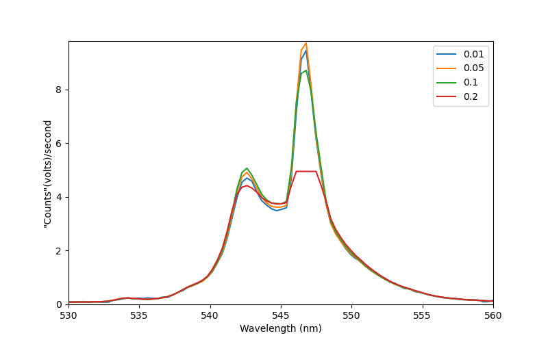

# TCD1304-SPI
TCD1304 with reproducible, linear response, 16 bit, SPI

  

## Introduction
Reproducibility is one of the vital elements of scientific measurements.  For a spectrometer, that generally means linearity.   When you double the light intensity or the exposure time, all of the peaks in your spectrum should double in height.   That is a basic and critical requirement for obtaining reporoducible and meaningful results with a spectrometer.   Here we will provide designe files and firmware for a linear CCD system that is linear and gives you reproducible results. 

As it turns out, some commercial spectrometers are actually not very linear (despite cost, popularity and citation numbers).  As it turns out, desinging for spectroscopy with a linear CCD presents special challenges.   The present design was devloped by instrumentation physicists specifically to address these issues.    But first, let's demonstrate what the problem looks like.

At present we are bringing the repo up to date, so hang tight for a bit and we will have the latest best available for you soon.  You will want the firmware that goes with the board.  So do wait until we have completed the uploads, which should be within about a week.   Meanwhile please message me if you have questions or would like to express interest.

### The commerical instrument
The following are fluorescent lamp spectra collected with one of the most popular commercial CCD spectrometers at different exposure times. We divide intensity by exposure time. So, all of those curves should lay on top of each other. To make things more clear, the third graph shows the ratios of the heights of three of the peaks from the spectra. The peaks heights are not proportional to the exposure time, and even the height of one peak compared to another changes when you change the exposure time.

### The new linear response TCD1304
Here is similar data to the above, but no collected with the TCD1304 system from this repo.  BOM is about $150, optics around $200 from Thorlabs or ebay. The processor is a Teensy 4.0

As you can see, the curves now do lay over each other, except where it saturates at longer exposure times. And the relative peak heights are pretty flat, again until one of the peaks saturates. That is what you want if you want to be report spectra when you publish your research.

### Contents of this repo
This repository at present contains the preliminary gerbers, schematic and BOM.  We will be adding updated design files, firmware, python code and a detailed explanation of how this works and in particular how we identified and solbed the linearity problem.

If you have questions in the meantime, please feel free to contact me.
