# TCD1304 Sensor with Linear Response and 16 Bit Differential ADC

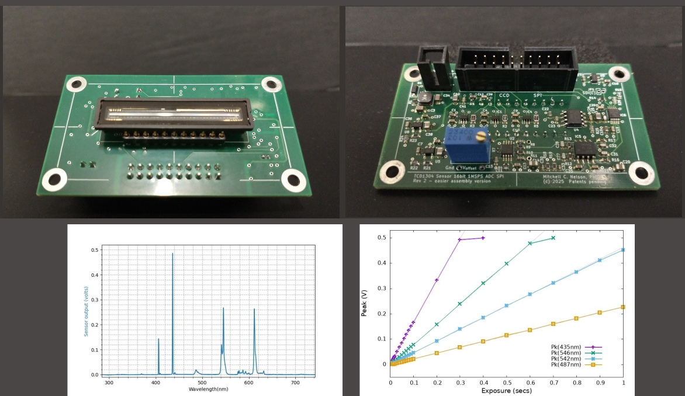

 

By [Dr M. C. Nelson](https://github.com/drmcnelson/TCD1304-Sensor-Device-with-Linear-Response-and-16-Bit-Differential-ADC),  [Copyright 2020-2026](#LICENSE)

This project provides a scientific-grade implementation of the TCD1304 linear CCD, specifically engineered to address non-linearities, including sampling undershoot and residual charge artifacts, that limit many open-source designs and commercial OEM spectrometers. 

#### Table of Contents
- [Introduction](#introduction)
	- [SPI Instrumentation Project](#-the-spi-instrumentation-project---open-instruments-for-open-science)
	- [Permissions](#-permissions-no-warranty-or-guarantee-and-etc)
- [High-level description of the hardware-firmware-software architecture](#high-level-description-of-the-hardware-firmware-software-architecture)
- [Getting it all up and running](#getting-it-all-up-and-running)
	- [Assembling or obtaining boards](#assembling-or-obtaining-boards)
	- [USB connection](#usb-connection)
	- [Loading the firmware](#loading-the-firmware)
	- [Setting up and running the python codes](#setting-up-and-running-the-python-codes)
- [On Linearity and reproducibility in CCD spectrometers](#on-linearity-and-reproducibility-in-ccd-spectrometers-with-data)
- [Setup for linearity testing](#setup-for-linearity-testing)
- [Spectrometer design and construction](#spectrometer-design-and-construction)
- [Electrical design (a tutorial)](#electrical-design)
	+ [TCD1304DG electrical characteristics](#tcd1304dg-electrical-characteristics)
	+ [Signal conditioning](#signal-conditioning)
	+ [Interfacing to an ADC](#interfacing-to-an-adc)
	+ [SPICE model for the 16 bit sensor board](#spice-models-for-the-16-bit-sensor-board)
	- [Gate driver and analog signal integrity](#gate-driver-and-analog-signal-integrity)
- [Appendix A - quick command list](#appendix-a-quick-command-list)

## Introduction

This repo offers a linear-CCD sensor system based on the TCD1304DG that is designed specifically for *reproducible linear response*. For a spectrometer, as will be shown, linear response is a prerequisite to reproducibility. Non-linearity in this case involves both intensity and its first derivative as the spectrum is clocked from the device, and it is not easily treated through numerical correction.  It has to be addressed in electrical design.  A second issue that effects reproducibility involves the device physics of the sensor; how the sensor is driven and operated to effectively move charge from the detector region and along the shift register to the output.  All of this is addressed in the detector system and software provided in this repo, and is described in this readme and supported by data.  We also describe how to obtain and work with the boards and software.  Finally, the effort to develop and post this device and the supporting data, is part of a project to develop and make available open instruments that support open science and underfunded scientists.  You can help through the "support" button at the top of the page.

The following is offered as a quick preview of data that we will discuss in greater length and compare with data collected side-by-side from a popular commercial instrument in the section ["On Linearity and Reproducibility"](#on-linearity-and-reproducibility-in-ccd-spectrometers-with-data).  The figure here, labeled (a), shows spectra with intensity divided by exposure time.  In (b) we graph the intensities of several lines versus exposure time. We see that the normalized spectra overlay each other very well, and that the intensities are linear over nearly the full dynamic range of the instrument.

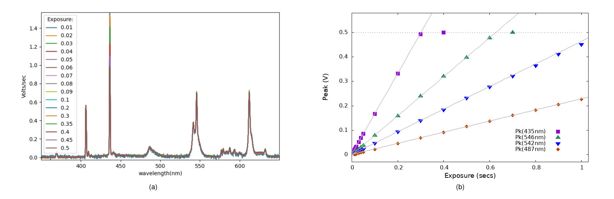

<i>
(a) Fluorescent lamp spectra normalized to exposure time exhibit consistent intensity and baseline. (b) Peak heights are linear in exposure time to near saturation.
</i>

The above seems like simple, minimum criteria for an instrument that you might want to use in your research and so, we humbly invite the reader to subject a CCD spectrometer that they may have to the same test.

Since their inception in the late 1980's, CCD spectrometers with their "all at once" spectral capability and low cost, have been looked to as a potentially important contribution to the scientist's toolbox.
But as most of us who have worked with these since that time are well aware, there have always been issues including non-linearity, unstable base line, intensity carried over from the preceding exposure, and so forth.
The goal of this project was to finally and fully address these issues and produce a definitive design for the TCD1304 that provides data that is linear and highly reproducible that we can actually use to collect data and publish our research.

In our studies leading to the present design, the TCD1304 itself proved to be remarkably linear. (Some vendors attribute their non-linearities to the sensor; it is not true.)  Rather, the challenge is in electrical design to account for both the nature of the signals produced on reading a spectrum or technical image from the CCD and the stricter requirements on linearity for purposes of a scientific instrument.  The "carry-over" though inherent to the physics of the device, is a function of how the device is operated.  We show that it can be made negligible or treated numerically.  These challenges are  perhaps not too complicated, but they do require experience in having actually used these instruments as a scientist, some meticulous attention to detail and careful analysis to design an instrument to do the job properly.  In general we feel that design of a scientific instrument should proceed with at least the same uncompromising exactitude with which it will be used.  We offer the present design with the hope that this will "set a new bar" for CCD based spectrometers.

In this README we cover a lot of ground, from getting and working with the boards, describing linearity, non-linearity and other behaviors effecting reproducibility in real instruments and  providing a tutorial in electrical design with example circuits and SPICE models to illustrate key points. 

This repo provides (a) fab files and BOM for making the boards, (b) firmware as an Arduino "sketch" and a header-only C++ library, (c) host software in Python that can be used as a class library or command line interface with realtime graphics, (d) this README with test results and tutorials for electrical and optical design, and (e) a collection of SPICE models as referred to in the text and including those we used to develop and test the design. 

The sensor device is offered in three versions (high-end 16 bit, or lower cost 12 bit, or analog), along with firmware ("sketch" file and header-only library), a user interface program (with graphics) and class library (Python) and an offline data processing program and class library (Python) to read and graph the ASCII files saved by the controller.  All three versions of the hardware, when used with the provided firmware and a Teensy 4.x, are able to provide reproducible linear response.  With the 16 bit system we have obtained linear reproducible results over 5 orders of magnitude in exposure time (from 10usec) in clocked and triggered data collection.

We begin with a summary of what is contained in the rest of the readme and repo.

### Implementations

We provide three implementations of the sensor system hardware (see the following figures); (a) a two board implementation comprising the [sensor board](TCD1304_SPI_Rev2EB/) and our [Teensy 4 based instrument controller](https://github.com/drmcnelson/Instrumentation-Controller-T4.0-Rev3), (b) a single board ["All-In-One"](TCD1304_All-In-One_FlexPWM/) implementation with sensor and MCU on back and front of the same board, and (c) an [Analog board](TCD1304_Analog) with the sensor, signal conditioning circuit and gate drivers with analog output of the inverted and amplified sensor signal.
The firmware and Python codes provided in this repo, can be used with any of the three hardware implementations.

In the following we provide a high level description of each of the three implementations  For each we also describe the cost and choice to build or buy.  The costs include the sensor and microcontroller, currently running at
$40 and $24 respectively
and the PCB which generally runs around $18 per board in small quantities (including tariffs).

#### Two board system, 16 bit sensor board and controller
The high end sensor system, shown here, is a two board system comprising sensor board and controller. It offers very low electrical noise with a 16 bit 1MSPS ADC and good mechanical isolation of the sensor from the controller.  The ribbon cable carries logic signals and power for the SPI interface (1.7V-5.1V).  The two wire connection (red and black) is 5V power. Internally, there are separate low noise power circuits and ground planes for the analog section and gate drivers. We observe 0.6mV dark noise, electrical noise is more than 10 times lower (less than 1 LSB with the sensor removed). And the board is able to linearly follow peaks to full scale in one pixel.  Fiduciary marks on both sides of the sensor board facilitate optical alignment.

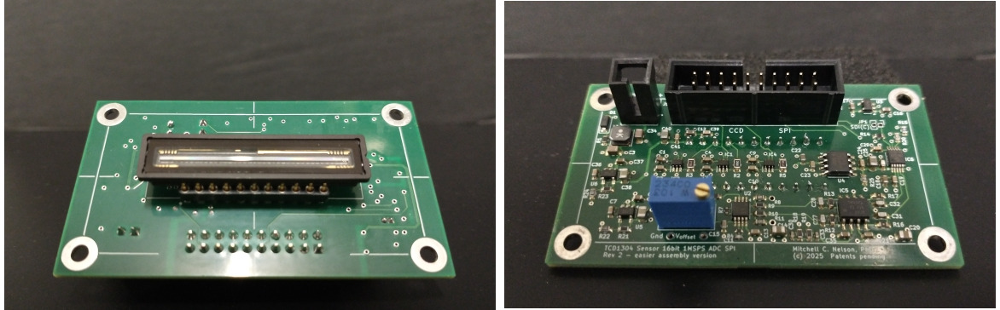
 
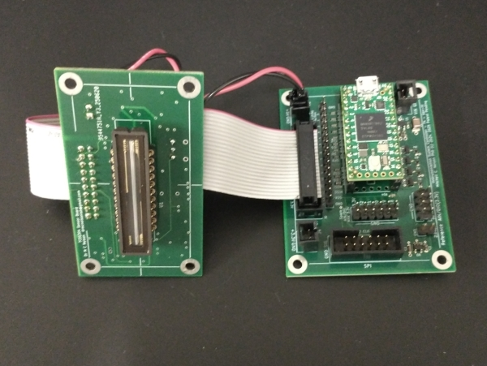

<i>
TCD1304 Sensor system, (a) sensor board bottom showing sensor and fiduciary marks, (b) sensor board top showing circuits, interconnects and baseline trim, and (c) sensor board and controller showing geometry and interconnection (control and data plus 5V power).
</i>

Component costs for the high end 16-bit system are currently $110 for the sensor board and $88 for the controller, or $198 for the set, plus the time it takes to do the assembly work.  The passives are generally 0603, some are 0402 and two of the ICs are 0.5mm pitch.  It takes us a few hours per board for hand assembly, or about one day per board set.

We recently switched to using a PCBA service for the SMT parts (we prefer ALLPCB for their customer service).  Normally this would bring our costs to $290.
With tariffs our cost per set is now $395 to $422 depending on the clearance agent.  We feel that compared to hand assembly it is still a bargain.
 

#### "All-in-one", sensor and controller on a single board.
The following shows the single board "all-in-one" device with sensor, electronics and controller all on one board.  This device offers similar performance in terms of linearity to the two board system, but with 12 bit precision.  It has a single ended analog signal path and uses the built-in analog input of the Teensy 4.0 (and therefore has fewer parts, costs less and is easier to hand assemble).

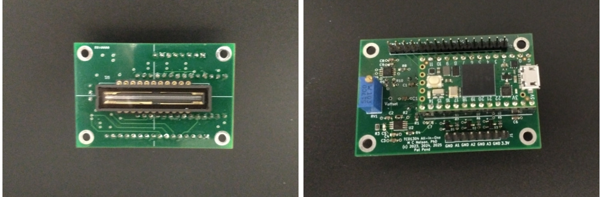
 
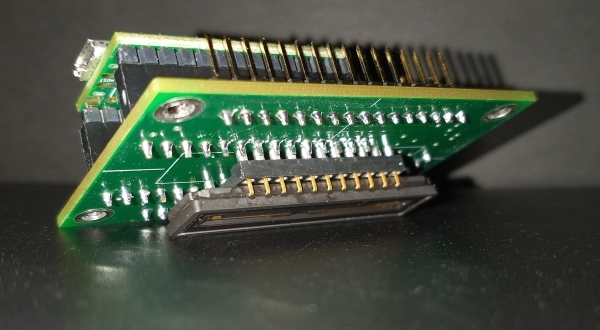

<i>
TCD1304 All-In-One Board, (a) bottom showing the sensor, (b) top showing the microcontroller board and pins for auxiliary functions, and (c) view showing the overall geometry.
</i>

The component costs are currently $86 including TCD1304 and Teensy, plus $18 for the PCB, for a total of $104. We generally assemble these in house. The passives are 0603 or larger. The two IC's are 8 pin, 0.65mm pitch. It takes us a few hours or about half of a day.

#### Analog sensor board with gate drivers
The following shows our analog-output sensor board.  This also has the single ended analog circuit as in the all-in-one board, and similar gate drivers. The board can be powered from 4V to 5.5V and accepts 3.3V to 5V logic to operate the CCD gates.  We developed this board to provide a better and actually useful alternative to the analog boards offered on some DIY sites.  The output is intended to be compatible with the inputs of typical processor boards in the Arduino ecosystem, but linearity and ability to meet the clocking requirements for the CCD sensor will depend on which Arduino ecosystem board and firmware you choose to use.   Running the board from our Teensy 4.0 controller and firmware, we found that it has very good linearity and, similar to the above, it is able to track peaks to full scale in one pixel.

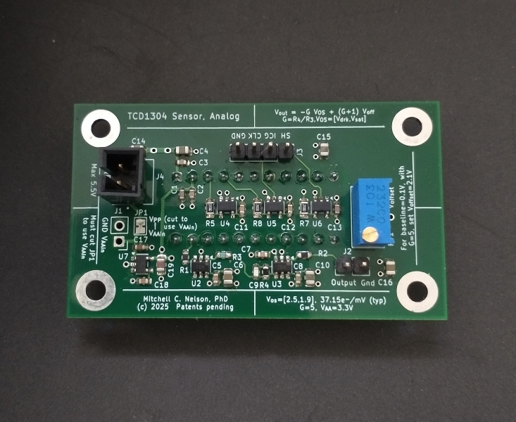
&nbsp;
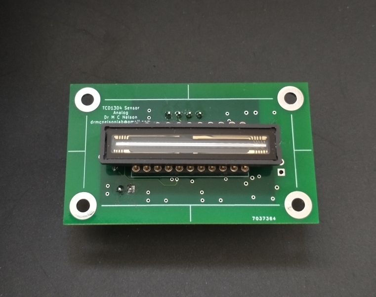

<i>
TCD1304 Analog Board, (a) top showing the circuits and connectors, (b) bottom showing the sensor.
</i>

Parts costs are currently $65 including the TCD1304, plus $18 for the PCB per the above, for a total of $83. The passives are 0603 and the ICs are SOT23 packages to make it a little easier for hand assembly.  It takes us perhaps 3 hours to build.

### Reproducibility and linearity

As noted, reproducibility is vitally important for any instrument and for a spectrometer linearity is a pre-requisite for reproducibility (as well as for basic capabilities such as signal averaging). And CCD spectrometers are historically challenged for both linearity and reproducibility. We discuss this at length in the section titled [Linearity and Reproducibility in CCD Spectrometers](#on-linearity-and-reproducibility-in-ccd-spectrometers-with-data).  We show examples in data collected from a commercial instrument and compare this to data from the present design where the results are linear.  The data illustrate the relationship between linearity, reproducibility and being able to produce meaningful data.

### Construction of the spectrometer used for testing

Construction of the spectrometer used for testing the new sensor is described below [(here)](#spectrometer-construction).
We use a 1200/mm grating and 200μm entrance slit with a focal length of 2 1/4".
Total cost of materials for the spectrometer is under $400, including the electronics (this repo), optics and mechanical parts.

### Controller

As noted, we operate the sensor board using our newly updated ***Instrumentation Controller*** based on the Teensy 4, with its NXP i.MXRT 1060 ARM7 MCU [(please click here)](https://github.com/drmcnelson/Instrumentation-Controller-T4.0-Rev3).
The T4/NXP platform is somewhat unique among MCU boards in the Arduino ecosystem for both its speed at 600MHZ and its high speed USB at 480Mhz.   Additionally it provides a flexible timing generator (FlexPWM) which we feel is better suited to the task of operating the TCD1304 compared to the PWM peripherals offered in other MCU boards.   In the present system, including firmware and software, we are able to produce well controlled exposure times to as short as 10usec and frame rates a little faster than 100fps. 

### Firmware

The firmware [(here)](Firmware/), written for the T4, includes a header-only library to operate the sensor, and a "sketch" file (Arduino source code, similar to C++) that implements human readable commands and responses, operates the sensor to produce frames by clock or hardware trigger, and sends the data back to a host computer.

We expect that the firmware provides all of the functionality you may want for almost any sort of experiment.  However, we provide the TCD1304 library and the complete source code so that you can modify it if you wish.   We work with the code using the Arduino IDE for compilation and Emacs as an external editor. 

### Python user interface with graphical display

The Python code [(here)](Python/) can function as a user interface or as a class library.  When invoked directly, the code presents a graphical monitor and command line interpretor with human readable commands. When used as a library from another program (see "import"), the spectrometer is available as an instance of a class object.  The Class provides both high and low level functions to work with the device.  The design emphasizes simplicity and performance, again with anticipation that scientist users can modify the Python code to their purposes.   The command "help" lists detailed help text from the controller and from the Python code.

### Electronic design

A tutorial on electrical design for CCD sensors and spectroscopy is included [here](#electrical-design).  The section begins with the datasheet and characteristics of the sensor, proceeds to signal condition and driving an ADC and finishes with a section on the gate drivers.  SPICE files are included in a subdirectory of the repo.  You can modify the SPICE files to investigate your own designs.

### Fab files (Gerber, BOM) and codes

The fab files and code provided in this repo, and in the controller repo, plus some cabling and a host computer, should be sufficient to assemble the boards and get your detector system up and running.  Feel free to contact me for consultation or pre-assembled boards (time permitting).  And needless to say, donations are very much appreciated, please find and "click" the sponsorship button above.

###  The SPI Instrumentation Project - Open Instruments for Open Science
The contents of this repo are part of our effort in ***Open Instrumentation for Open Science***.  

We believe that access to doing great science should not be limited to those privileged in funding and affiliation nor held ransom to the extractive practices of the market in scientific instruments. And anyway, you may feel better served by instruments developed by other scientists who actually use them and have decades of experience designing professional instrumentation. The designs we provide can often be built at about 1/10 of the cost of the commercial instrument.  In our own research, we are typically able to do more with these boards than we can with the expensive commercial instruments.

At this writing, we have received requests and helped scientists working in Europe, Africa, India, Canada and the USA.

One very important way that you can help underfunded scientists is by clicking the "Sponsor" button at the top of this repo.   The funds go to helping to make more instruments more available to more scientists around the world.

If you would like to sponsor or receive boards, please contact me.

###  *Permissions, no warranty or guarantee, and etc.*
Permission is hereby granted for you to build and use these boards and codes in your lab and for your personal use.
Please cite appropriately if you use these in your published work.

Please contact me if you need/want:
<ul>
<li>
Pre-assembled boards
</li>
<li>
Customization, advice, etc.
</li>
<li>
Permission for use in a product or other commercial effort
</li>
</ul>

And of course, no warranty or guarantee is given whatsoever.  We did our best.

If you have questions, please feel free to contact me.  And of course, don't forget to click the "Sponsor" button (or contact me directly).

 ***
## High-level description of the hardware-firmware-software architecture

The sensor is operated through four input pins, a clock and two gates plus a fourth for the "convert" pin of the ADC, and an SPI interface which retrieves the data from the ADC.  These connect to the controller and the controller in turn connects to the host as a serial port device over USB.  The controller also provides a trigger input and sync output and additional pins that can be used to interact with other equipment.  

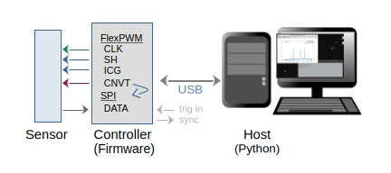

The controller operates the sensor device with its FlexPWM  module programmed to serve as timing generator for the clock, gates and ADC convert signals, and its SPI module to read the ADC. A small set of interrupt service routines maintain frame counters, measure exposure times, and so forth.
At the end of the readout, the data record and the various parameters that accompany the data record are organized into a C struct as a "frame" and put onto a ring buffer.  In the main thread, the function loop() checks the ring buffer, sends pending data frames to the host, and processes command inputs from the host computer.  Every command is acknowledged by sending "DONE" back to the host.

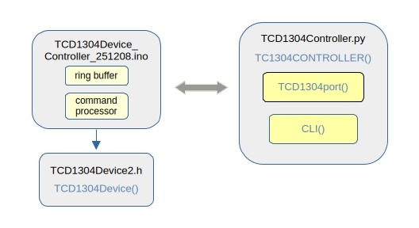

The Python code running in the host, represents the sensor device and its controller through a class object, TCD1304CONTROLLER.  A multiprocessing thread TCD1304port listens to the port to receive data frames and messages sent in response to commands, and interacts with the main thread through a set of queues; the data queue, a queue for commands to send to the controller and a graphics queue for real time display.  The graphics window runs in a separate thread also.

Thus we have two levels of buffering, one in the controller and one in the host software, and commands and data are serialized on both ends of the interconnection between the host and controller.  The commands and responses are all simple human readable ASCII.  Data can be transferred as binary or ASCII.

The sensor board internals include the TCD1304DG sensor, gate drivers, analog signal conditioning and ADC.  The external interface comprises the three gate inputs, an input to command the ADC and SPI to retrieve the data.

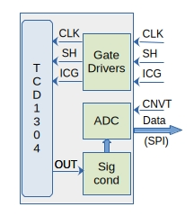

 

Achieving linearity and reproducibility is to a large extent a function of hardware and firmware. The analog subsystem and ADC provide linear response to spectroscopic signals, the gate drivers enable effective retrieval of charge and the firmware provides effective operation.

***
## Getting it all up and running
This sensor board is intended to be used with our new [Teensy 4 (T4) based controller](https://github.com/drmcnelson/Instrumentation-Controller-T4.0-Rev3). 
The files provided here (gerbers and code) and in the controller repo, plus some trivial cabling and a host computer (we recommend Linux for the best frame rate perfomance) should be sufficient to build and operate the boards. 

If you are using the "All-In-One", then you have the TCD1304 and circuitry and the Teensy 4.0 all on one module. The gerbers are provided in their own directory in this repo.  There is one macro switch in the firmware that you need to uncomment to compile for the "All-In-One" board.

### Assembling or Obtaining boards
You can assemble the boards yourself, or if you prefer, please feel free to contact me for pre-assembled boards.

If you want to assemble your boards, and this is your first time assembling an SMT board, search for an introduction to DIY SMT assembly, [for example here](https://www.kingfieldpcb.com/essential-tips-for-diy-smt-assembly/).

Here are some notes on how we do assembly in our shop.
We order PCBs from AllPCB, JPLPCB, and PCBWay. We usually order parts from Digikey, but we also use Mouser and Newark.  We use Chip Quik no-clean solder paste in a syringe dispenser with fine needle tips that we order separately. And we use a reflow oven that we purchased through ebay for about $200, and sometimes we use a temperature controlled rework heating stage that we purchased through Amazon.

### USB connection
We recommend using a powered USB hub with switches to turn individual USB devices off and on. When you shop for this, make sure it supports high-speed (at least USB2.0) and can supply at least 1A per port.  For example, a powered 7-port USB hub should be able to supply at least 1A x 5V x 7 ports = 35W.  

### Loading the firmware
After the boards are assembled, you will need to install the Teensy board in the controller, and compile and load the code into the Teensy.  You will most likely want to use the Arduino IDE for this.  Teensy is well integrated into the IDE. [See here for setup instructions.](https://www.pjrc.com/teensy/td_download.html)   The Teensy needs to be connected by USB to your host computer for this step.

The firmware codes are found in the repo in the Firmware subdirectory

(In the following, the "251208" in the directory and file name, is the date of this version of the firmware.  If there is a newer version when you read this, use that one.)

    TCD1304Device_Controller_251208/
    
      TCD1304Device_Controller_251208.ino  - The controller program with CLI
    
      TCD1304Device2.h  -  A header-only C++ library for the TCD1304 and Teensy4.x (iMXRT106x)
      
      parselib.cpp      - A string parsing library for the CLI
      parselib.h

      Doxyfile          - Doxygen configuration file

      TCD1304Device_Controller_refman.pdf
                        - Listing generated by doxygen
      

The Arduino IDE requires that the "ino" file and directory have the same name.

To load firmware into the "All-In-One" board, open the file **TCD1304Device2.h** in a text editor or find its "tab" in the Arduino IDE, and un-comment the following line. It is at line 23 in the current version of the file.

      //#define ALLINONEBOARD

If you want to customize the firmware, it is recommended to create a new directory, copy the files to that directory and rename the ino file per the above.

After installing the Arduino IDE and Teensy package, you should be able to double click on the ino file to start an IDE session, or start the IDE and navigate to the directory and open the file.  

### Setting up and running the Python codes

Python codes and Bash scripts for operating the TCD1304DG sensor and working with the data, all under Linux, are provided in the repo under the subdirectory Python/.

The codes have been used with the Fedora Cinnamon Spin, which you can [download from here](https://fedoraproject.org/spins/cinnamon).   This uses xorg rather than Wayland, the desktop is Win7-like and it is easy to work with terminal windows. We have also done some preliminary testing in Ubuntu.

#### Installing the Python environment

The command to install the Python environment and libraries used by the codes is as follows (in Fedora, use apt-get or aptitude in Ubuntu):

    $ sudo dnf install python python-numpy python-scipy python-matplotlib python-pyserial
      

#### Setting up the user software for the TCD1304 boards
To setup the Python codes from this repo, unpack or download the files from the repo's Python subdirectory to a directory on your Linux machine; somewhere under your personal user directory works just fine.  And, set the permissions to allow execute  (chmod a+x *.py, and chmod a+x *.sh).

Here is a list of the files provided in the Python directory

    TCD1304Controller.py   - User interface and Class library
    
    GraphicsWindow.py      - Libraries used by TCD1304Controller.py
    GUIWindow.py
    TextWindow.py

    DataReader.py          - Offline library and graphics utility

    SetupPATH.sh           - Adds the code directory to PATH
        
    GraphTCD130Spectrum.sh - Offline graphics using DataReader.py
    
    Calibration2           - example wavelength calibration

 

#### Running the user command interface with real-time display and post collection shell scripts

You will want to add the directory for the Python and bash scripts to your PATH. You can do this by adding the following line to your .bashrc.  Alternatively you can run this from a command terminal, but you would then need to do it each time.  Note that the command begins with ". "

    $ . pythoncodesdirectory/SetupPATH.sh
  
After all of the above, make sure that your sensor controller is connected to your compute with a USB cable, that the cables are connected correctly if you are using the two board implementation, and then turn on the power and wait about 1/2 minute.

Now you can run the controller program.

    $ TCD1304Controller.py

The controller should open a grahics window.  The desktop will look something like this.

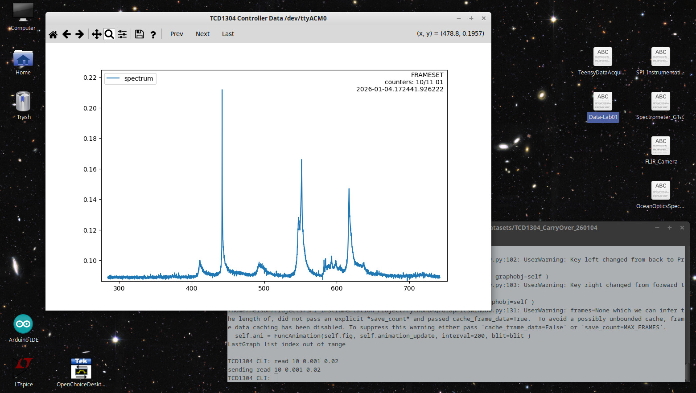

Notice that in the console window, we have a prompt.  This is the command line interface presented by the Python program.  The Python CLI provides commands to wait, save to disk, run commands from a file, run shell commands, and etc., and passes all other commands to the hardware.  The command **help**, produces a listing of the commands recognized by the hardware and Python CLIs.   A listing of the help output can be found in the repo [here](Python/TCD1304.help).  A summary of some of the most often used commands can be found at the [bottom of this readme](#appendix-a---quick-command-list).

**The firmware** provides commands at three levels.  The high level commands include the following to collect clocked or triggered data.

       tcd1304cli> read <n frames> <exposure>
       tcd1304cli> read <n frames> <exposure> <frame interval>
       
       tcd1304cli> trigger <n frames> <exposure>
       tcd1304cli> trigger <n frames> <exposure> <frame interval>

The first form collects "back-to-back" frames with exposure time congruent with the frame interval.  This accommodates intervals as short as about 8-10 msecs (the time it takes to read the sensor).  
Dark noise has a minimum at about 10-20 msecs.
There is no effective upper limit on exposure time in this mode, apart from the increase in registering cosmic rays. Signal averaging can be done on line (see **add**) or after data is save to a file.

The second form collects fast "frame sets" with short exposure times. The exposure time in this mode can be as short as 10&nbsp;μsecs depending on pulse widths.  The frame interval needs to be at least the readout time plus the exposure time, c.f. 10msec for a 1msec exposure. The maximum frame interval in this node is about 55&nbsp;msecs. Signal averaging is available for this mode, too.

The trigger input can be configured as follows, where \<option\> can be any of rising, falling or change, pullup or nopullup, or pin \<pin-number\>.

       tcd1304> configure trigger <option>

For kinetic studies using back to back exposures, the following command can be used to configure the pulse sequence to run "cleaning pulses" before each exposure. You can read more about this [here](#residual-image-and-relationship-to-the-gate-driver).

       tcd1304cli> configure clearing pulses <n>

Middle level commands including **setup pulse..**, **setup frameset...**, **setup timer**, **start** and **trigger**, provide data collection capabilities with detailed control of the timing for the pulse sequence that operates the sensor.  There is also a complete set of low level commands for register level access to the FlexPWM timing generator in the MCU.

**The Python controller program** saves incoming data onto a queue. The command **save \<filespec\>** retrieves and writes the data to disk.  The command **clear** empties the data queue without writing to disk.  The saved data includes the "0" frame. The first exposure interval is frame 1.

Data frames can be added using **add all** which sums all of the data into one frame, or **add all after n** which sums all the frames after the first "n" frames, or **add framesets** which sums the data at each index in the frame set.  After adding the frames, you can use **save** as above, or collect more data and add again.  (See the next section "On Linearity and Reproducibility...")

Following is an example that shows the data produced with a single frame at low intensity compared to that produced by adding 100 frames collected at the same signal intensity.  The signal to noise ratio increases by a factor of 10 as expected (√N).  Aside, being able to add data frames and obtain meaningful data is possible only when your instrument is linear.  We will discuss this in further detail in the next section.

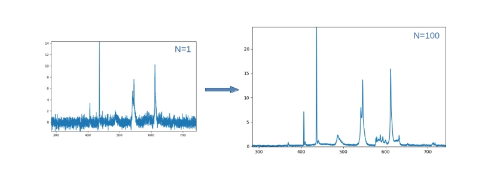

The program and class library **DataReader.py** can be used to work the offline data.  The command line accepts python language statements and can produce graphs.  Setting variables x, y, y2, etc., generates a 2-d graph.  Setting surface or image generates a 3d surface or heatmap.

The following example generates a simple 2-d graph of electron counts divided by exposure time. Omitting --output sends the graph to the screen.  More examples are included in the bash scripts in the distribution.
       
       bash# DataReader.py mydatafile \
               d=dataset[0] \
               x=d.xdata \
               y="d.frames[-1].dataCounts()/d.exposure" \
               xlabel="\"Wavelength(nm)\"" \
               ylabel="\"Counts/sec\"" \
               --output mydatafile.png

To list all of the available variable names and data associated with a file,

       bash# DataReader.py mydatafile --dump

The data files are in ASCII and human readable.  If you wish, you can  work with the files using a spreadsheet program.  The advantage of DataReader.py, whether you use it from the command line or as a library, is that it parses the file into Class objects and you can use the full power of the Python libraries to work with the data.

 ***
## On Linearity and reproducibility in CCD spectrometers (with data)

In this section we discuss linearity and reproducibility in a practical sense, as it relates to CCD spectrometers. After defining terms and concepts, we show data comparing the present design and a widely used commercial instrument.  These illustrate the basic concepts and establish in a small way the "facts on the ground".

Linear response, for a spectrometer, means that the  measured response S is proportional to the number of photons P impinging on the detector. For a change in intensity at pixel "n", we expect that ΔSn = cn ΔPn where cn is a constant.  

When a system is linear we should see that (a) spectra collected with different exposure times agree with each other  (S1/t1 = S2/t2), (b) ratios of peak heights are constant (Sλa/Sλb at t1 = Sλa/Sλb at t2), and when summed the result agrees with that obtained by a single measurement with the combined exposure time S = St1 + St2 = St1+t2.

Notably our linearity criterion was expressed as a change in P and S.  Normally we would apply the above rules after subtracting a noise or background signal. Conveniently, for this kind of sensor, the dark noise SD is proportional to exposure time in the range of exposure times greater than 20msec and for this sensor system the electrical noise is several orders of magnitude smaller than the dark noise.  Therefore, for these longer exposure times, the total intensity (S = SP + SD) should also be linear.

That said, there are a few ways in which spectrometer response can be non-linear. Some of these can be corrected numerically provided the non-linearity meets certain mathematical criteria.  For example, measured values should at least be monotonically increasing in exposure time so that there can exist a unique mapping between a measurement and its corrected value.

However, some non-linearities involve bandwidth or line shape. And while a valid correction might exist, it is most often far easier and far more reliable to start with an instrument that has linear response.

So far we have talked about linear reproducible response to the signal produced by the sensor. We will next show some examples, give mention to another class of behaviours associated with the physics of moving charge within the sensor, and then finish with some further discussion of [linearity and electrical characteristics of signals in spectroscopy](#on-origins-of-non-linearity-and-electrical-characteristics-of-ccd-spectrometers). Detailed discussion of anomalies associated with charge distribution, is included at the end of the section on [gate and clock drivers](#gate-driver-and-analog-signal-integrity).

Let's look at some data.

### Spectra
The following are fluorescent lamp spectra, from the present design and from a commercially produced spectrometer.  Notice that the line at 436nm in the new instrument is about twice the height of the 546nm line whereas in the commercial instrument it is attenuated by a factor of 4.  The lines at 436nm and 546nm correspond to well known lines of Hg.  Their tabulated intensity ratio is approximately 2:1, similar to that obtained with the new instrument (a) [("Strong lines of Mercury", NIST)](https://www.physics.nist.gov/PhysRefData/Handbook/Tables/mercurytable2.htm).

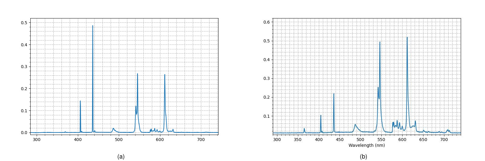
 

<i>
Fluorescent lamp spectrum, (a) new sensor and (b) commercial instrument.
</i>

This seems like a simple test.  But some care is appropriate.  One way to alter the spectrum is to simply misalign the sensor.  But then the effect should be systematic.  In this instance the intensities of the other lines seem inconsistent with the large difference in the 436nm line.

The following shows the spectrum from the new instrument with the y axis expanded so that we can see the structure in the region around 590nm. We see that the lines are a little sharper compared to the commercial instrument.

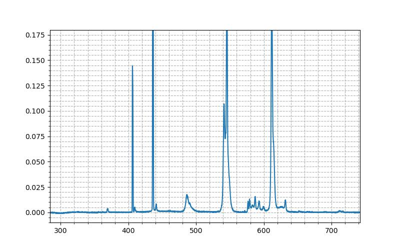
 

<i>Spectrum from the new instrument with expanded intensity scale to show detail around 590nm and 615nm.
</i>

### Intensity
The following shows the raw intensities versus exposure time for  four of the peaks that appear in the above spectra for the present design and the commercial instrument.  We select the strongest two lines, at 435nm and 546nm, and the smaller peak at 542nm and the wider peak at 487nm.  The vertical scale for the present design is volts.

In a linear instrument, all of these intensities should rise linearly with exposure time or overall intensity. With the new sensor (a), the curves are indeed straight lines from near the origin until near  saturation. For the commercial instrument, most of the range is not linear.  We will see more explicitly how this effects relative peak heights.

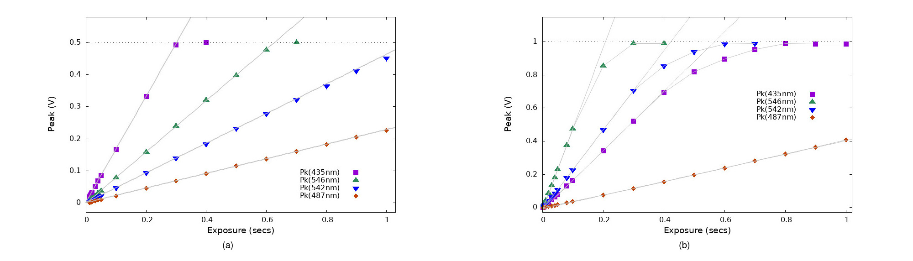
 

<i>
Intensity versus exposure time for four spectral lines for (a) the present design and (b) the commercial instrument.   The present design demonstrates linear response.
</i>

### Consistency and practical reproducibility
A simple test for consistency and practical reproducibility is to collect a few intensities of the light source, or by moving the source farther or closer, or by simply changing exposure.  Any of these will vary the number of photons and hence the number of electronics registered in each pixel.  When the sensor system is linear, we should be able to scale by exposure time (or power, or R2) and obtain the identical spectrum apart from the difference in signal to noise ratio.

Here is the result varying the exposure time, for the new sensor (the present design) and the commercial instrument.  As we noted in the introduction, the spectra produced by the new sensor are neawrly identical apart from noise.

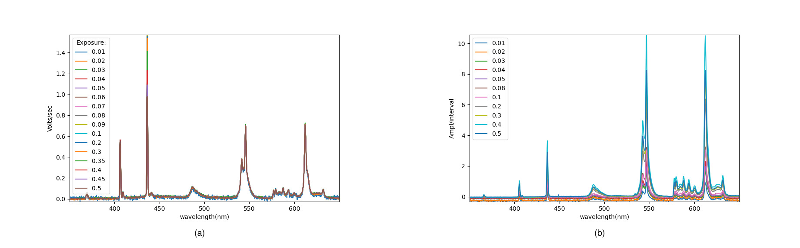
 

<i>
Spectra normalized to exposure time for the (a) the present design and (b) the commercial instrument. </i>

We refer to this as practical reproducibility for the simple reason that even though we might reproduce the spectra by exactly reproducing the exposure conditions in the original experiment, unless there is a way to correct the data (solve the inverse problem) it says very  little about the thing being studied.  And in these sorts of non-linearities the inverse problem might not be tractable.

### Peak height ratios
We reasonably expect that in a reliable instrument ratios of intensity should not change when we change intensity or exposure time. 
First, we expect that spectra should have the same appearance in terms of how large one peak is compared to another when we repeat a measurement. Second, quantitative comparison of intensities is a basic element of many experimental protocols.

The following set of figures shows ratios of peak heights as a function of exposure time.  The present design shows roughly constant peak height ratios until one of the peaks in the ratio reaches saturation.

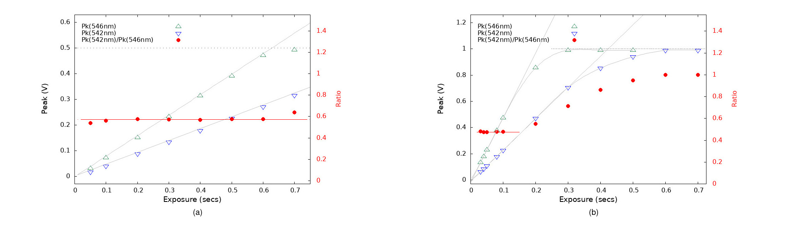
 

<i>
Peak height ratios for the lines at 546nm and 542nm versus exposure time in (a) the present design and (b) the commercial instrument. </i>

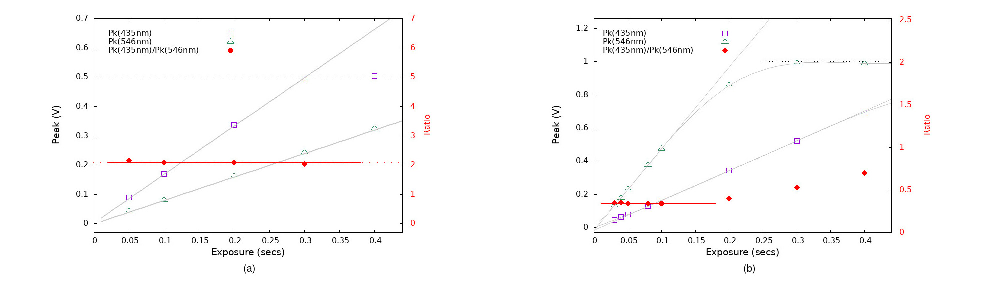
 

<i>
Peak height ratios for the lines at 435nm and 546nm versus exposure time in (a) the present design and (b) the commercial instrument.  The correct ratio is close to 2:1 with the line at 435nm the larger.</i>

### Some further phenomena
The above are examples of non-linearity in the conventional sense of linear response of a circuit and digitizer to an analog signal.  There are two further issues that can effect linearity in a different way.

#### Baseline integrity
Baseline or background subtraction is often a necessary step in extracting intensity data from spectra.  There are a number of ways to do this, for example using dark spectra or regions of spectra where the experiment produces little intensity.  The former assumes the background is independent of the signal of interest and the latter assumes background is dominated by the dark noise of the detector rather than light.

The following shows a fluorescent lamp spectrum from [Wikipedia](https://upload.wikimedia.org/wikipedia/commons/8/83/Fluorescent_lighting_spectrum_peaks_labelled.png).

Notice the anomalous baseline to the blue side of the sharp peak at 631nm.  The shape is not like dark noise nor any sort of room lighting.  The important point about this for the present discussion is that it is not easily corrected.

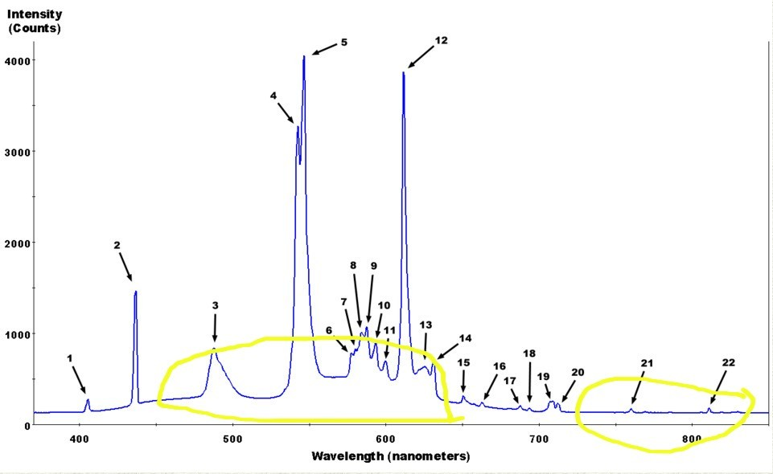

Fluorescent lamp spectrum. 
<a href="https://commons.wikimedia.org/wiki/File:Fluorescent_lighting_spectrum_peaks_labelled.png">Original:  Deglr6328 at English WikipediaDerivative work:  H Padleckas</a>, <a href="http://creativecommons.org/licenses/by-sa/3.0/">CC BY-SA 3.0</a>, via Wikimedia Commons

#### Residual image (carry-over)
In studies of dynamic phenomenon, we are interested in the intensity registered in the detector during the time of a particular exposure.
In CCD detectors there is always some residual charge that is carried over to the next frame. The magnitude of this carry-over effect depends on how the shift gate is driven.  In steady state phenomenon this effect can balance out after a few frames. As noted above, a detailed discussion is included at the end of the section on [gate and clock drivers](#gate-driver-and-analog-signal-integrity).

### A potential source of non-linearity in CCD spectrometers
The following provides some insight into how the above phenomena may emerge in a CCD spectrometer (or imaging system) and how this can be addressed.  For simplicity of exposition, we can think in terms of a simplified notional CCD sensor architecture. (The TCD1304 architecture is described further in a later section.)

The following depicts a circuit model for our simplified linear CCD, an array of pixels each compromising a photodiode and capacitor connected by a switch to one element of an analog shift register.

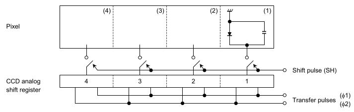

(From an archived application note, Toshiba)

The following shows a pixel in our simplified notional CCD, pink indicates n-doping. The shift gate (SH) opens a channel and biases the shift register to harvest charge from the photodiode.  The electrode labeled φ belongs to the readout register.

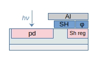

The following depicts the process for moving charge along the readout register (in the direction orthogonal to the plane of the above diagram). At the completion of each clock cycle (typically 2 or 4 clock pulses) charge has been shifted one step to the right. The charge at the last element is converted to a voltage and presented at the output.

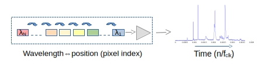

An important point for the present discussion is that the CCD records a discrete patten of light in space (or wavelength) and on readout this pattern becomes a discrete series of voltages in time.  Accordingly, a sharp spectral line becomes a short pulse in time.  This is what makes spectroscopy different from other signal acquisition scenarios.

#### What does this mean for circuit design?
In designing circuits for acoustics or radio frequency work, we might think in terms of a Nyquist frequency and we might accept some small non-linearity for signals approaching this "cutoff". But in a CCD spectrometer (or imaging system) a full scale step in voltage from one sample to the next can be a legitimate feature that has to be rendered to a meaningful digital representation. We can think of this in terms of bandwidth (units of 1/t) or in terms of dV/dt (units of V/t).

The following graph shows the Fourier transform of the above spectrum (blue) and the response curve (orange, y2 axis) for a simple single pole low pass filter with cutoff frequency at 1/2 of the sample rate. Naive filtering of this sort results in about 10% attenuation for the high frequency components that may be important for linear response to narrow spectral lines.

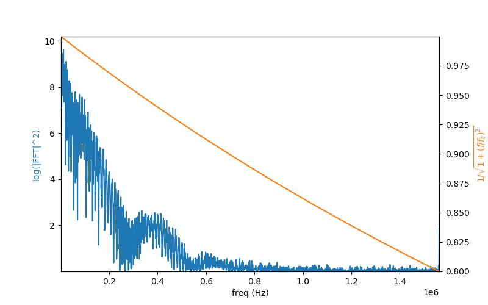

<i>
Fourier transform of the fluorescent lamp spectrum (blue) and single pole f/2 filter (orange).
</i>

Now let's look at dV/dt. Here we graph the spectrum as dV/dt versus time (as read from the sensor). The spectral line at 436nm that is markedly stronger in the present design instrument also has the largest dV/dt.
In electronics, dV/dt is related to *slew*.

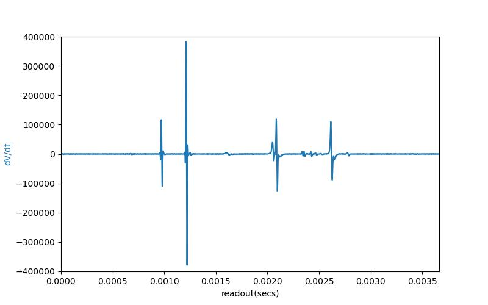

<i>
First derivative (dV/dt) of the fluorescent lamp spectrum.
</i>

There are a number of ways in which circuits can be slew-limited, though current starving the sample and hold capacitor in an ADC is perhaps one of the more popular methods.  Choosing an OPAMP with too small a maximum slew is another.   And a well abused emitter follow is a third method that seems popular in the DIY ecosystem.  As we will see the difference in cost to do this correctly is small.

For purposes of a scientific instrument, we require linearity over the full range of line shapes that we might observe.  We will discuss how to accomplish this and a surprising previously unappreciated challenge, in the [section on electrical design](#electrical-design).
 
---
## Setup for linearity testing

The equipment list for our linearity study is as follows.  Construction of the spectrometer is described [here](#spectrometer-construction)

<ol>
<li> Spectrometer</li>
<li> Fluorescent lamp</li> 
<li> Neutral density wheel filter for attentuation (individual filters can be used instead)
<li> 200μm optical fiber
<li> Miscellaneous mechanicals to hold the lamp, ND filter and fiber.
</ol>

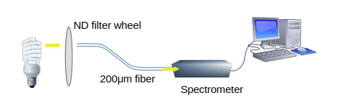

Once set up and aligned, the mechanical configuration remains fixed through the duration of the measurements.  The ND filter wheel is adjusted and left in a fixed setting for each dataset, each comprising a set of exposure settings.  

## Spectrometer Design and Construction
The following describes a simple approach to designing a spectrometer, and in particular the instrument that we used to test the new sensor device.  We will see that the choice of lenses and grating emerge in a simple way from the choice of spectral range and the size and pixel density of the sensor.

For our design, we use a transmission grating rather than a reflecting grating and folded geometry. The transmission geometry is simpler and provides good performance with reasonable cost. The following pictures show (a) the inside of the instrument, sometimes referred to as the "optical bench" and (b) the cover which is constructed of black opaque plastic.  The base is aluminum plate.  The sensor can be seen mounted after the second lens and the controller can be seen at the top rear of the cover with a blue USB cable running to the computer.  For the present design we chose a center wavelength at 500nm.  The wavelength range is 450nm. Optical resolution is about 0.5nm with a 50um slit.

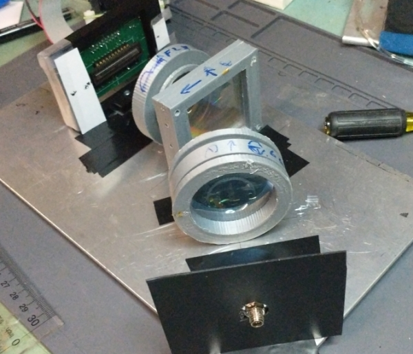  
&nbsp;
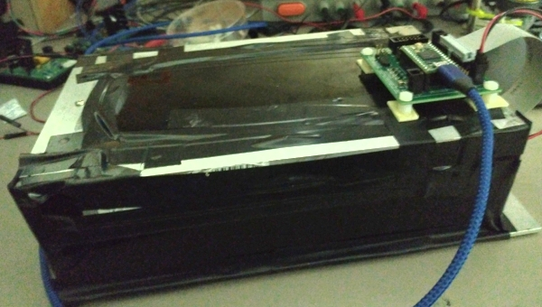  

The parts list for the above is:

<ol>
<li>Grating, 1200 grooves/mm, Thorlabs GT50-12, $250</li>
<li>200μm entrance slit, DIY-Optics.com, ~$30</li>
<li>Plano Convex lenses (50mm to 70mm bfl), ebay, ~$20</li>
<li>SMA905 fitting, Amazon, Digikey, Mouser, Ebay ~$15</li>
<li>Aluminum plate, OnlineMetals.com or Amazon</li>
<li>Mounts produced with a 3-d printer</li>
<li>Opaque black plastic sheets and black PVC tape, Amazon</li>
<li>TCD1304 sensor board and controller from this repo, with cables</li>
</ol>

### Design of a CCD Spectrometer
The following diagram shows the transmission geometry.  Two lenses sandwich a grating with an aperture at the focal point of the input and the sensor at the focal point of the output and oriented parallel to the grating. 

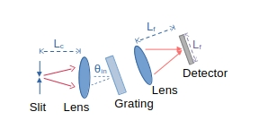

A productive way to think of this is that the optical system images the aperture onto the sensor, the grating transforms wavelength to angle, and the sensor samples the resulting spatial pattern.

#### The "master equation" and an essential criterion
If there can be said to be a "master equation" for a CCD spectrometer, it would likely be the following 

δλ/Δλ = M wslit/LD 

wherein the ratio of spectral resolution δλ to range Δλ, is equal to that of the widths of the slit wslit and detector LD multiplied by the optical magnification M.

The optical magnification contains a factor for the geometry multiplying the ratio of the two focal lengths,

M = (cos(θin)/cos(θout)) x (LF/LC)

For a CCD detector, we have a fixed number of pixels Npixels with which to sample our spectra.  Quite obviously it serves little use to have a peak of width δλ occupying less than a few pixels.  In practice a good choice is 5 pixels.  Therefore we want that

δλ/Δλ > 5/Npixels

For the TCD1304 we have 3648 active pixels in approximately 30nm of length. Therefore we want Δλ/δλ < 729.

Example: 

For 0.5nm resolution, our spectral range can be as large as 364.8nm.  To accomplish that with a 50um slit we need a  magnification of 0.82.

#### Center wavelength and geometry
We noted in the above that the magnification term is simply the normal magnification (ratio of focal lengths) multiplied by a term for the  geometry as the ratio of the two angles.

The geometry follows from our choice of the center wavelength, and our choice of grating, through the following equation, 

G λ0 = sin θin + sin θout. 

where G is the line density for our grating.

Example: 
  
For G = 1200 l/mm and a center wavelength of 500nm, we find that the sum of the sines is 0.6.   If we set the exit angle to 0, then we have θin = 37 degrees. (A 1200 lines/mm, 500&nbsp;nm glass transmission grating will usually be blazed at 37 degrees.  See Thorlabs or eBay.)

#### Focal lengths, range and resolution

The spectral range to be covered by the instrument is a function of  the geometry, the size of the detector and the focal length of the output (focusing) lens,

G Δλ = cos(θout) LD/LF

Example: 
  
We want a range of 364.8nm.  Therefore the right focusing lens will have a focal length LF = 1 x 30mm/(1200 l/mm x 364.8mm) ≈ 68mm.

The spectral resolution is a function of the geometry, the size of aperture, and the focal length of the input (collimating) lens,

G δλ = cos(θin) wslit / LC

Example: 
  
We want a spectral resolution of 0.5nm with a 50um slit.  Therefore the right collimating lens will have a focal length LC = 50um x 0.8/(1200 l/mm x 0.5nm) ≈ 66mm.

Notice that our angles and focal lengths agree with our expected magnification factor, (0.8/1) x (68/66) = 0.82

#### Diffraction limit

One more thing to check is that we are not asking for resolution that is better than our **diffraction limit**. For the focus the diffraction limit is

 δλdiff = 1.03 λ0 M Δλ / 2 LD tan(NA)

and for the grating we have

 δλdiff = 0.84 λ0 cos(θin) / 2 G LC tan(NA)

where NA = n θ is the numerical aperture, n is the index of refraction and θ ≈ λ0/wslit is the angular spread at the entrance and focus spot. Both of the diffraction limit formulae reduce to approximately δλ/2.  In other words, for this instrument δλdiff ≤ δλ/2.
 

That completes the design, for our purposes.  

#### Construction

After settling on the parameters and digging through our box of lenses and gratings and aluminum plate, and perhaps ordering a few thing from ebay or Thorlabs, it is time to build the spectrometer.  We start with our Al plate and draw two lines intersecting at the selected angle for the incoming and outgoing optical axes.  The vertex is where the grating will be mounted.  Then holes are drilled to mount the lenses, each at about 20 to 30 mm from that vertex to leave space for the grating housing.  We 3-d printed the mounts for the grating and lenses.  Then, mounting one lens at a time, we use a flash light to find the location of the focus of each lens along its line. That is where the aperture and sensor will be located. Note that the sensor is actually 0.7mm behind the face of its window.  We drill the remaining mounting holes, install everything, apply black tape to dampen stray reflections, and connect the cables to the sensor. We tweak the location of the sensor while monitoring the spectrum with the software with a fluorescent lamp as input.  Now we cover the instrument with a non reflective case, save a fluorescent spectrum and calculate the coefficients to convert pixel number to wavelength and load them into the instrument (see the firmware command "coefficients").

 

***
## Electrical design

We now describe some of the elements of circuit design for a CCD based spectrometer (or imaging system).
This will be something of a tutorial.  The idea is to support open science.  That includes being open about what you need to know to design something like this for yourself. We assume some basic knowledge of electronics.  The "attentive reader" will note that we make extensive use of SPICE models.

We include a set of SPICE models in the [SPICE subdirectory](SPICE/).  These form the basis of most of the illustrations shown in this README.

We start with characteristics of the TCD1304DG and then proceed through signal conditioning to the ADC, gate drivers, and power architecture.

The reader may also be interested in reading the description in our repo for the original "All-In-One" board, [here](https://github.com/drmcnelson/Linear-CCD-with-LTSpice-KiCAD-Firmware-and-Python-Library).

### TCD1304DG electrical characteristics and operation
The TCD1304DG datasheet can be downloaded [here](https://toshiba.semicon-storage.com/us/semiconductor/product/linear-image-sensors/detail.TCD1304DG.html).
The device architecture is shown in the following figure found on page 2 and labeled "Circuit Diagram".  We see a photodiode array, shift gate (SH), integration clear gate (ICG), CCD analog shift register and signal output buffer (OS), with pins SH, ICG, master clock ΦM, and OS plus power and ground.

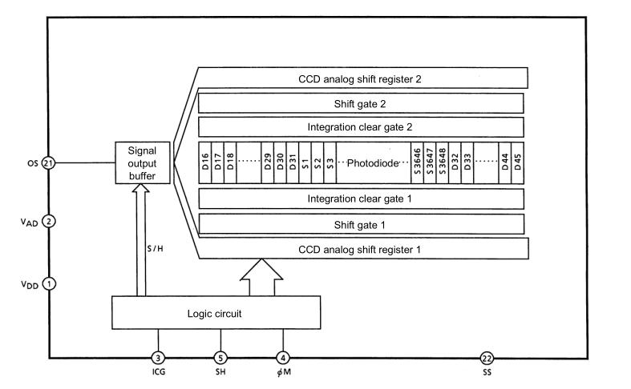

TCD1304DG "circuit diagram", from page 2 of the datasheet.

Operation of the device is shown in the following timing diagrams which can be found on pages 6 and 7,

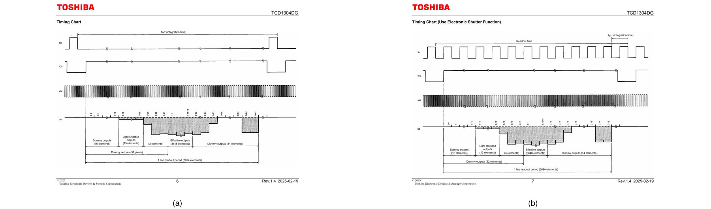

TCD1304DG timing diagrams, (a) coherent shutter and exposure, (b) "electronic shutter function", from page 6 and 7 of the datasheet.

As depicted, exposure begins and ends on the trailing end of pulses asserted on the SH pin, readout begins following assertion of SH and ICG together, and thereafter, data is clocked out at 1 pixel per four cycles of the master clock ΦM.

A table of capacitances for these pins is found on page 5. Without going into the details of how CCDs are constructed [(see here](https://www.chronix.co.jp/chronixjp/material/pdf/chronix/CCD-Image-Sensor-English.pdf)), we can infer that the large capacitance of the SH and ICG pins are consistent with these playing an important role in harvesting charge in the device. Four clock cycles per pixel readout further indicates a 4 cycle type CCD register. 

We discuss how to drive the gates, and in particular the shift gate [here](#gate-driver-and-analog-signal-integrity).  The present discussion focuses on the analog signal conditioning part of the design.

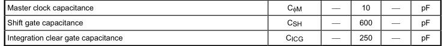

TCD1304DG "gate capacitance", from page 5 of the datasheet.

Electrical characteristics of the TCD1304 output are described on page 3 of the datasheet (excerpted here). We include the diagram from "Note 8" to indicate the origin and direction of the signal in volts.  The output is a negative going signal from fixed DC level VOS typically 2.5 volts (var 1.5V to 3.5V) to VOS -0.6V  at saturation (min -0.450V) and the output impedance is typically 500Ω (max 1kΩ).

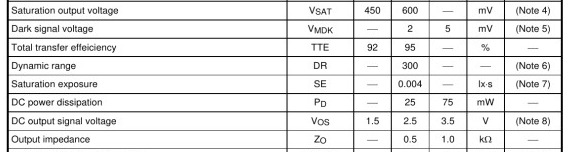
 
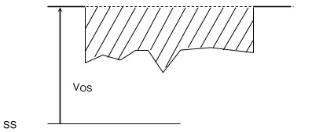

### TCD1304DG noise
The TCD1304DG datasheet reports dark noise as 2mV (typ, max 5mv) with 10 ms exposure. The following shows our measurement of the dark noise as a function of exposure time using our 16 bit sensor board.  As expected, dark noise is linear in exposure time. But there appears to be a floor for dark noise at about 0.6mV, which it approaches for exposure times less than 20ms. 

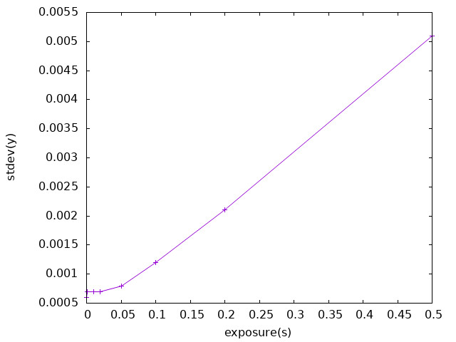

Dark noise vs exposure time in the new sensor device.
(Electrical noise with sensor removed is ~14uV)

Removing the chip from the board, the electrical noise is about 14uV. So it seems that the dark noise signal at 0.6mV really does originate in sensor chip.

Dark noise is known to be related to temperature with the usual Boltzmann dependence.
Some have reported reductions in noise by a factor of 4 with modest cooling to around 4C.

### Signal conditioning
For best performance we want to match the output of the TCD1304DG to the input range of our ADC.  For the two board configuration, this will be a 16 bit high precision ADC with a differential input and 4V reference. For the "all-in-one" board this will be the 12 bit analog input of the MCU with a range of 0 to 3.3V.  In either case we need to shift, flip and amplify the output from the sensor to match the input range of the ADC.

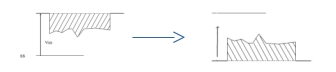

#### Single ended signal conditioning
The following shows a reasonable approach for a simple shift, flip and amplify while accommodating the wide variation in output impedance of the sensor.  We use a dual OPAMP, the ADA4807-2, slew 225μV/s, input noise 3.1nV/√Hz, 0.1pA/√Hz, and input capacitance 1pf. The first unit is configured as a voltage follower to take care of the large variation in source impedance and the second is setup as an inverting amplifier with offset.  This gives us reproducible gain and it provides linear response with good noise performance.  We use this approach for our 12 bit systems including the "all-in-one" and analog boards.

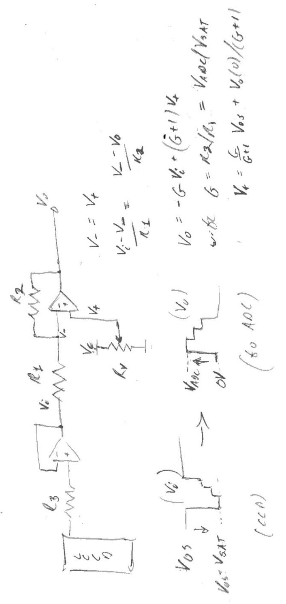

#### Low noise differential signal conditioning
We use the following approach for 16 bit precision.  Similar to the above, the first unit is configured as a follower but the second is configured as an inverter with offset and unity gain.  The two outputs together provide a differential signal.  In implementation we follow this with a fully differential amplifier (FDA) and a differential input ADC.  For gain we get a factor of 2 for free and make up the rest in the FDA.  Cancellation between the differential pair improves noise performance for our mixed signal environment.

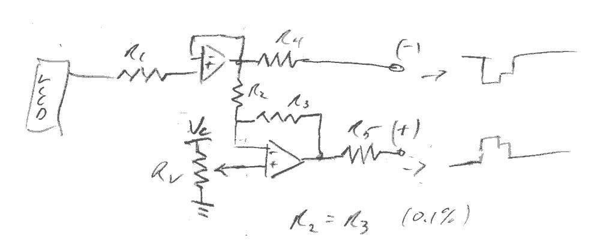

#### A don't-do DIY circuit
The following shows a design that appears from time to time in DIY postings.  The inventor typically omits the voltage-follower and instead goes straight to the inverting amplifier.  This of course makes the sensor part of the gain equation, G = R2/(R1+Rsensor).  But the sensor impedance as we noted above, varies from 500Ω to 1kΩ.  If the inventor is aware of the issue, they might make R1 very large to drown out the contribution from the sensor.  But to have gain, R2 has to be even larger, typically 2 to 5 times R1.  Now come the problems. 

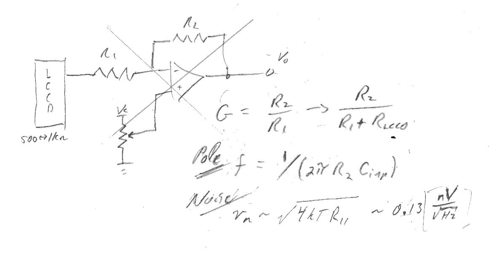 off.

With large values for R1 and R2 there is a large parallel resistance that dominates the noise density at the input, vn ≈ 0.13 √R// [units nV/√Hz] (see "Johnson noise").  This creates a trade-off between bandwidth and precision.
And with a very large R2, the pole formed with the input capacitance of the OPAMP at fp = 1/(2πR2Cinp) moves to lower frequency and can be within the bandwidth needed for readout.  The amplifier may be unstable and the data unreliable.  All of this is for a net savings of about $3 for leaving out the voltage-follower.  If you need to report spectra with reproducible intensities, it might be best to avoid devices that take this approach.

#### Another don't-do circuit
This is another circuit that shows up in the DIY ecosystem.  It is a basic transistor circuit that can be found in the first chapters of many electronics textbooks.  Intermediate level text may treat the non-linearities and other limitations of the circuit including those related to trying to use it to drive an analog input.   Here we will try to explain in a simple way why this is not a good idea for a spectrometer.

The following shows the bare emitter follower in two flavors, on the left with a PNP transistor and on the right with an NPN.  Notice the output is taken at the emitter.

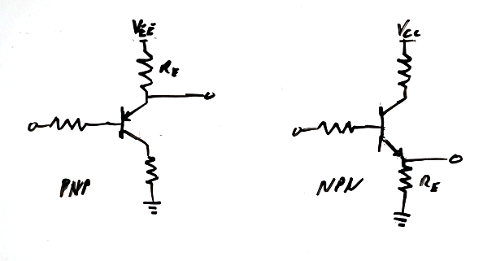

PNP and NPN followers.

Provided conditions are such that the base-emitter diode is "on", the output can be thought of as being maintained at one diode drop above (below) the input,

Vout = Vin +/- VBE

where VBE is the base-emitter voltage.  The basic non-linearity is that VBE is not a constant, but is instead a function of emitter current and temperature

VBE = VTln(IE/IS)

and the emitter current IE varies with the output voltage,

IE = (VEE - Vout)/RE

The quantities VT for the thermal voltage (\~25meV @RT) and IS for the saturation current (10-15-10-12A), are both temperature dependent.  All of this comes to about 1-2\% variation in gain, if not for the next issue.

The more serious issue arises in the proviso that the  base-emitter is "on".  Consider the following in which we model the emitter follower with 1k resistors for the emitter resistor and load.  Note that without the transistor, the voltage at the node connecting R1 and R2 would be 1/2 of the supply voltage.  We can operate the emitter follower to this voltage and no higher. Below this voltage current flows into the emitter.  When the output reaches this voltage the emitter current is zero and we can go no further. Increasing the input voltage only further reverse biases the diode.

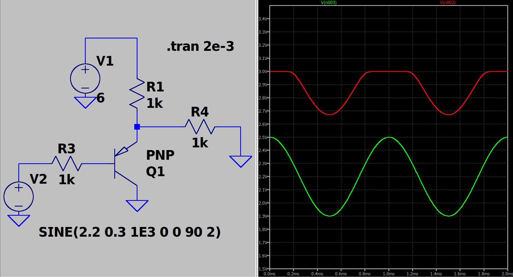

PNP follower with resistive load.

The situation is a little more complicated with a reactive component, c.f. a capacitor, in the load and more so with the switched capacitor input of an ADC. Typical behaviors are summarized in the following.

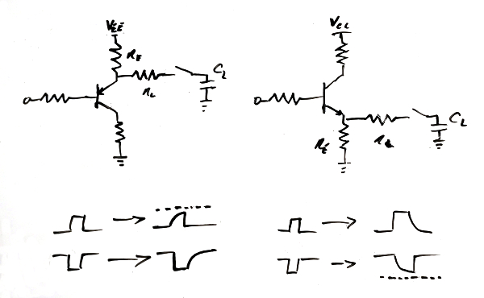

PNP and NPN followers driving the ADC sampling capacitor.

The PNP(NPN) works very well as a current sink(source), i.e. for the falling(rising) side of the waveform.  On the other side, the maximum slew rate is current limited.  Provided the current required ΔV/RL is less than the quiescent emitter current, the maximum slew rate in this part of the response is

(dV/dt)max = IE/CL = (VEE - Vout)/RECL

For larger ΔV/RL, the slew rate drops further to

(dV/dt)max = (VEE - Vout)/(RE+RL)CL

Recall that accuracy in an ADC depends on the sampling capacitor being able to reach the input voltage before the end of the sampling window in time.  It is therefore easy to see that current limited slew is something that needs to be considered carefully.  Let's consider some examples.

For 16 bits of accuracy and a 0.5usec sampling window, we need a maximum slew of at least 16 x ln(2) x 0.6V/0.5usec =  14V/usec (or 10V/usec for 12 bits).  In practice we should use a circuit with a significantly larger maximum slew to avoid the roll-off region.

Lets consider a 16 bit ADC, with CL = 30pf, RL = 1K and VEE = 3.3V from a low noise LDO rather than the USB power line. Our maximum slew with the emitter follower is 6V/usec.  But,  with a 12 bit ADC 10pf and 2K, the maximum slew would be 10V/usec.  If we go for 10 bits, then we might avoid the roll of region for slew.  The issue with that is that there is still the non-linearity in the response and the precision is not sufficient for the dynamic range of the detector.

So, the approach with a single transistor follower is marginal at best for these parameters.  There are ways to make it better, but at that point you will have come close to reinventing the opamp.  The cost for a dual ADA4807 which is rail-to-rail, very linear and has a slew rate of 225V/usec, is only $5.

 

### Interfacing to an ADC
The present application requires analog to digital conversion at rates from 200KSPS to 1MSPS and between 12 and 16 bit precision depending on your specific needs. This put us in the domain of the SAR type ADC (successive approximation register) [see here](https://www.analog.com/en/resources/analog-dialogue/articles/the-right-adc-architecture.html).  There are some important details to using a SAR type ADC and moreso for our application.  This involves some nuance, so we start from the basics.

#### Spice model for ADC input
The SAR architecture comprises a sample and hold (S-H) circuit followed by a comparator and DAC which are operated by internal logic to implement the successive approximation algorithm.  The S-H circuit is seen by the driving circuitry as the input to the ADC.   In a simplified sense, it looks something like the following but with the switch driven by a clock.

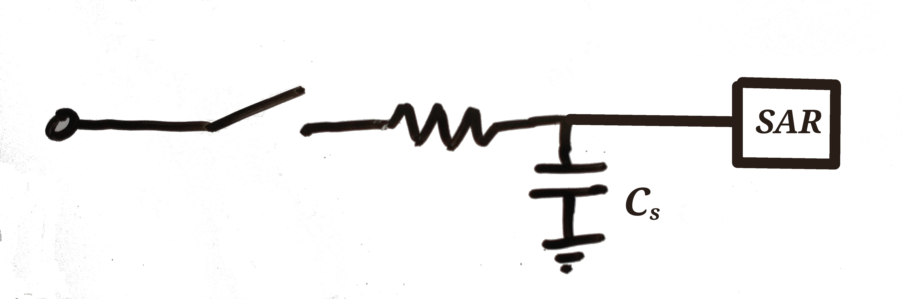 

We can implement this in a SPICE model as follows. For purposes of illustration, we include an ideal voltage source as the input.  C1 is the sampling capacitor, S1 is the switch that connects C1 to the input, and S1 is controlled by the clock V1.  When S1 opens, the voltage on C1 is converted to a digital representation by the SAR engine.  The time during which S1 is closed, is called the sampling window.
(Values for the internal resistance (Ron) and capacitance (C1) for a given ADC are usually available in its datasheet.)

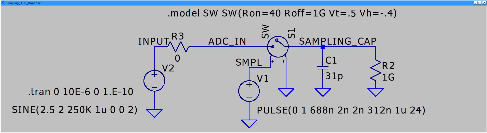 
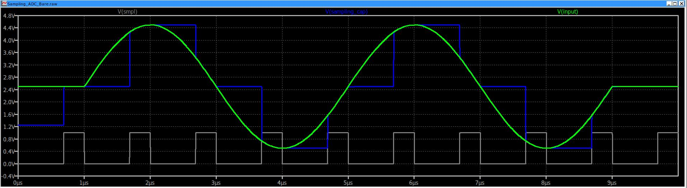

ADC model with ideal voltage source.  Green = input, blue = sampling capacitor, grey = sampling window.

#### Factors effecting precision
For n bits of precision and full scale range Vfs, the voltage on C1 at the end of the sampling window has to be within 1 part in 2n of Vfs.
The input always has some series resistance, in this case Ron.
Therefore the sampling window has to be at least as long as n x ln(2) x Ron x C1.  

Voltage noise of a capacitor is <i>vc</i> = √(kT/C). 
For n bits of precision, we need <i>vc</i> < Vfs/2n.
The 30 pF sampling cap shown in the model produces about 11μV of noise and 1/216 = 15μV.

When you select an ADC, make sure to look for these parameters in the table of electrical characteristics or the equivalent circuit for the input in the datasheet.  Also don't forget to look at the graphs for SNR.  Often the SNR quoted in the beginning of the datasheet is less than the whole story.  And don't forget to look at PSRR.  And do follow the guidelines for selecting the voltage reference and for layout.

#### ADC kickback
Kickback describes what happens when the switch closes to connect the input to the driving circuit.

In the following we drive the S-H from a voltage follower instead of the ideal voltage source.  Now when S1 opens or closes we see spikes (circled) on both voltages and in the current through R1. This is the famous ***"<u>ADC kickback</u>"***. It arises in the current needed by C1 with the sudden change in voltage when the switch closes.

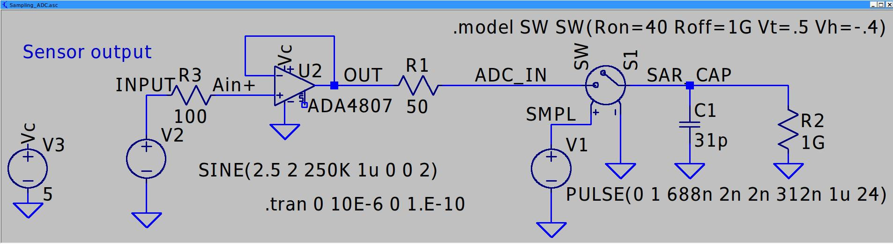 
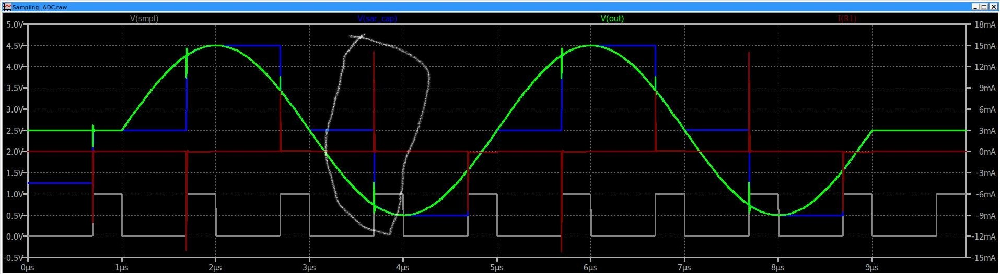

ADC model driven by OPAMP follower.  Green = out, blue = sar cap, grey = sampling window, red = current through R1.

 
#### Charge reservoir as solution for kickback
In the often recommended solution for kickback, we provide a charge reservoir in the form of a capacitor in front of the input to the switched capacitor network, as in the following illustration.  Now, when the switch closes, current flows from the charge reservoir, which is replenished on a somewhat slower time scale by the driver (the opamp).

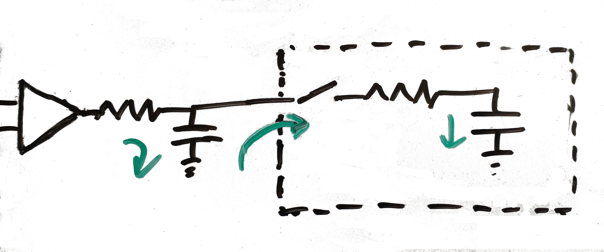 

The following shows the implementation of this scheme in our SPICE model. A cap C2 is added in front of the ADC to act as the charge reservoir for C1.  We see in the traces that charge for C1 now comes from C2 and the voltage on C2 is managed by a much smaller current through R1.  There is no discernible kickback in V(out) nor in the current through R1.

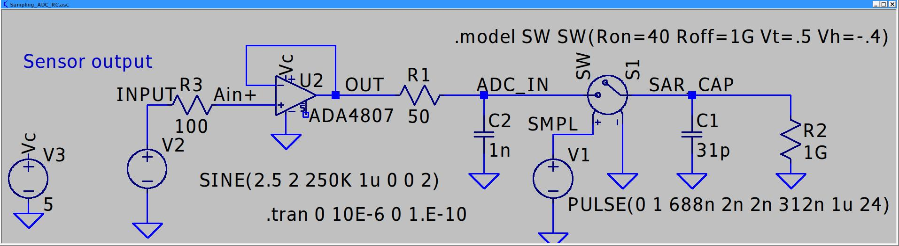
 
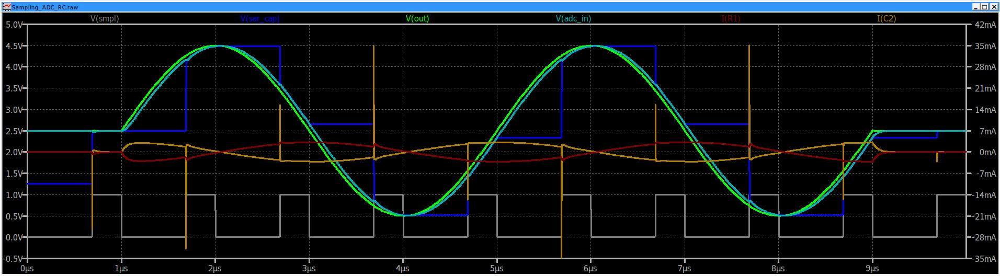

ADC model with recommended driver, charge reservoir C2.  Green = out, turquoise = adc in, blue = sar cap, grey = sampling window, red = current through R1, orange = current through C2.

The charge reservoir and series resistor together look like a low pass filter, but the components are chosen a little differently.
C2 needs to be large compared to C1 and R1 needs to be tuned between the current capacity of the OPAMP and allowing C2 to track the input. We make extensive use of SPICE modeling to check designs for response and precision.

#### dV/dt versus charge reservoir

You may recall our discussion about dV/dt and sharp spectra lines near the top of the README.  Here is what happens when a large dV/dt meets the charge reservoir that we added to support the sampling capacitor in the ADC.   The circuit in this example is a "full feature" single ended model from CCD to ADC.  The input is a pulse, and a little bit extreme with a 2ns rise time.

Notice that we now have a large current through R1 coincident with the leading and trailing edge of the pulse.  The current through C2 is as before.  So, large dV/dt meets cap serving as charge reservoir and produces a new kind of kickback.

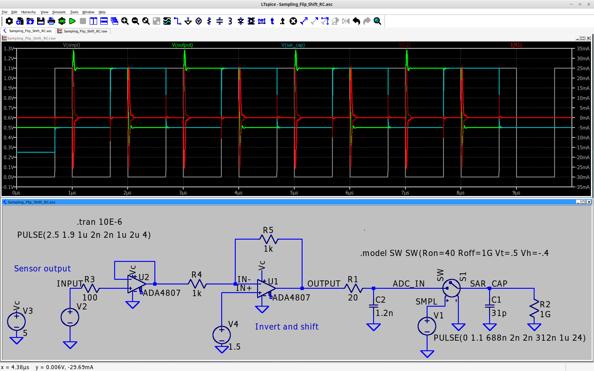

Effect of dV/dt in charge reservoir.  Green = out, turquoise = sar cap, blue = sar cap, grey = sampling window, maroon = current through C2, red = current through R1.

The following shows a method for mitigating the new kickback.  We simply slow the pulse a little bit with a low pass filter in the feedback loop.  This has to be tuned somewhat to put the current within the capabilities of the OPAMP but still allow C2 to recover fast enough to meet the design requirements for precision.  We are able to get 18 bit precision in models. Real spectra are less demanding and our precision spec is 16 bits.

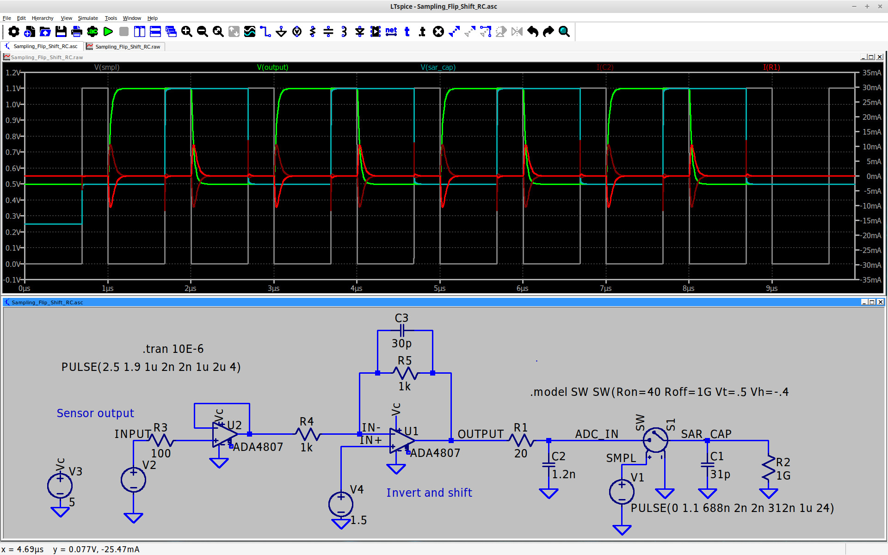

 
 
### SPICE models for the 16 bit sensor board

The following are screens from two of the spice models that we used in designing the sensor board.

#### Differential signal path and ADC
This is the [SPICE model for the analog signal path with ADC](SPICE/TCD1304DifferentialBuffer.asc).
The input is configured as a short pulse to stress the kickback management.  The second graph shows the voltage on the sampling capacitor converging to the input voltage within the sampling window.  Convergence is better than 1 part in 16 bits.

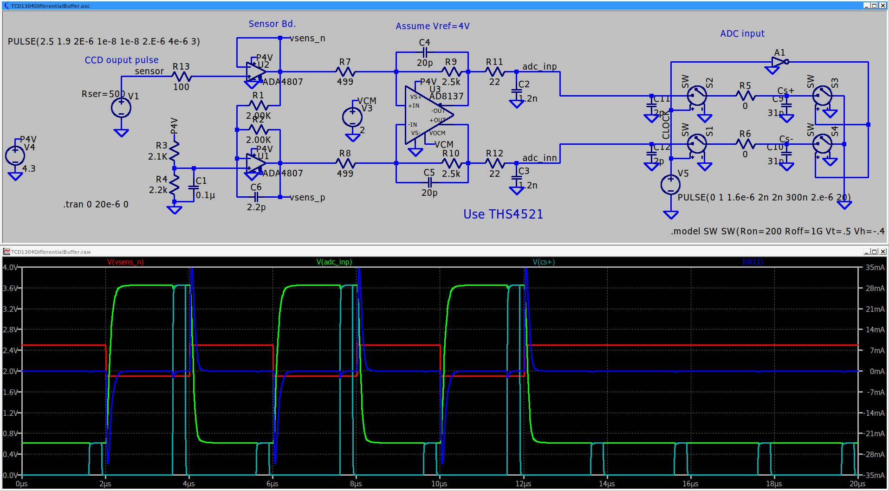

SPICE model for the 16 bit sensor board, analog section.
 
Red = sensor, Green = adc inp, turquoise = Cs+ (sar cap), blue = current through R11.

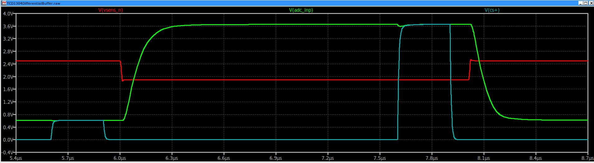

Convergence of V(Cs+) to input voltage for the 16 bit sensor board.
 
Red = sensor, Green = adc inp, turquoise = Cs+ (sar cap).

### Gate driver and analog signal integrity

Issues that require careful attention in designing the gate drivers, include the fact of the very large capacitance of the SH gate, the role of this gate in collection charge from the photodectors into the readout CCD register, and then an electrical effect in the rest of the circuit wherein noise from the gate drivers appears on the power rails.

#### Current requirements for driving the gates

Recalling the table at the top of the discussion on electrical design, we saw that the shift pin has a capacitance of 600pF.  As we will see in a moment, the shift pulse needs to be driven with a rise time that is short compared to the duration of the shift pulse, generally a factor of 20 can be appropriate.   This means that for a 1 usec shift pulse, we need at least 4V x 600 pf/ 50 nsec = 48mA.

A suitable way to drive the gate would look like the following.  We use a SN74LVC1T45 and an 82ohm series resistor.

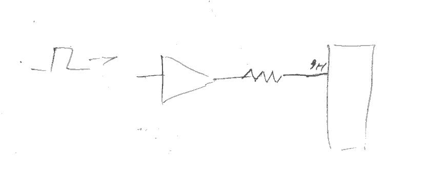

#### Mitigating noise generated on the power rails
The following shows a SPICE model for the gate drivers. These generate a pulse on their power rails, so we power these from a separate voltage regulator.  The model includes a current limited supply for the LDO with inductor, in place of the filtered current limited 5V supply on the actual board.

Gate drivers and pulse generation on the power rails.
 
Blue = V(sh), Green is V(icg), Red = (V(ccb)-4.0492) x 1000, Grey = I(R6)

Note that the trace for voltage pulse on the supply side of the gate drivers is scaled times 1,000.  Using this model we confirm that the amplitude of the pulse is well within our power supply noise budget for the analog signal path.

### Residual image and relationship to the gate driver
Now lets take a look at another way in which the gate driver effects performance in the analog section.  In our earlier discussion of linearity we briefly described the architecture of a simplified notional pixel comprising a photodector region and an  element of the shift register.  The following shows what that looks like in action.
Light produces charge, pulsing the shift gate moves charge to the shift register, which is then shifted away by clocking the shift register.  But, some charge necessarily remains behind in the photodector region.  The quantity depends on material properties, dimensions and temperature and the voltage and duration of the pulse applied to the shift gate.

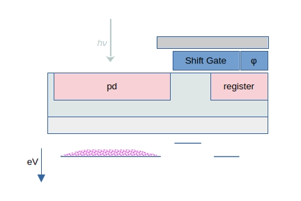

Let's see at what this effect can look like in practice.  The data in this section were collected using the analog sensor board so that we can vary the voltage on shift gate.  The sensor is operated by the controller with the standard firmware included in the repo. We use the low level pulse commands to vary the pulse width.  We coded a timing generator into another Teensy to turn on a red LED in every other frame.    The LED is on for 1.8msec starting 1msec into the first of each pair of rames, each frame is 10msec exposure back to back.

The following shows data obtained with the LED turned on (in blue) and then off (orange) per the above description.  The data is collected with a 1usec 4V shift pulse. Numerically, we find that the carry-over image is typically a copy of the preceding frame though noisier and on a reduced scale.

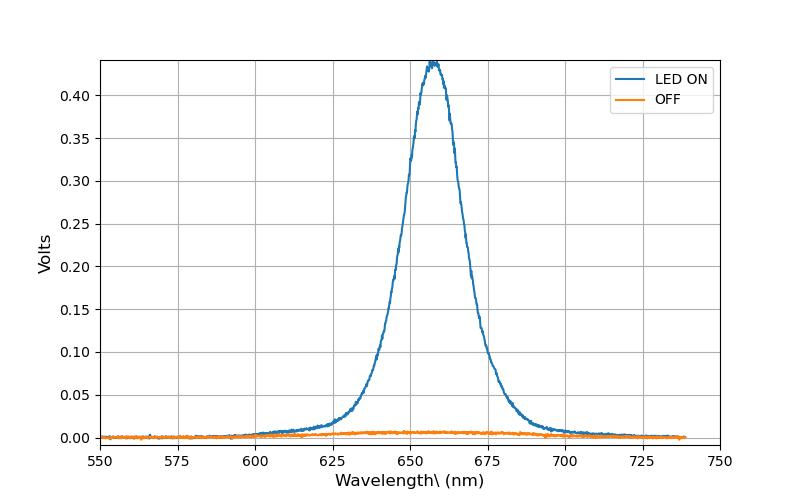

LED spectrum, orange curve is with LED off.

 

In the following figure we measure the carry-over intensity as a function of the width of the pulse applied to the shift gate and at several voltages.  We find that the "carry-over" signal decreases with an exponential time constant similar to that of the charging curve for the shift gate and its driving circuit.  In this case we have a 100ohm series resistor in series and the 600 pf capacitance of the SH gate, and thus a time constant of 60 nsec.

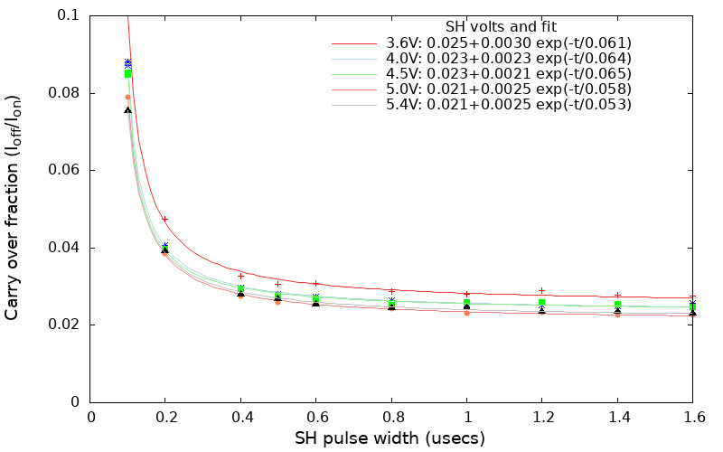

Initial carry-over is reduced with adequate SH pulse width.

In the next figure we pulse the shift gate a few times before we start the exposure.  Effectively this is like a series of short exposures, each leaving a percent or so of residual charge.  In other words absent confounding effects it is reasonable to expect that the carry-over should decrease exponential in the number of pulses and approach an asymptote.  The data suggests that in principle we might reduce the carry-over to 0.1\%.  In practice we use 4-8 clearing pulses to reduce the carry-over to 1% to 1/2\%.

Carry-over decreases with number of SH (clearing) pulses.

#### Mitigation
We can see that carry-over, in most instances will be a necessary part of the physics of the CCD detector device. But the effect is linear and reproducible and it can be made small.  Nonetheless, there are situations where we need to take this into account, for example in studying kinetics. 

In our lab we typically setup our triggered data collections to include  a few blank exposures, a small carry-over from a dark frame is smaller than the dark signal by definition.  For a timed series of exposures we might configure clearing pulses, depending on the time scale, and if needed we can calibrate the carry-over and remove it in post processing.  Other mitigation strategies are possible depending on how you design your experiment.

Following the dictum "always preserve primary data" we refrain from doing data manipulation inside the instrument.  This is easily done off line, using the program and class library DataReader.py.

***
## Appendix A - Quick command list

The following is a subset of the commands implemented in the TCD1304 firmware and in the Python user utility (indicated as CLI).  Enter the command "help" for a more complete listing and consult the source code for further information.

<b>Quick command reference </b> 
See <b>help</b> for more details

| **Operation:** | *commands:* |
| :----- | :---- |
| *Timed exposures* | **read &lt;n&gt;&lt;exposure (secs)&gt;  → [wait read]** |
|  | **read &lt;n&gt; &lt;exposure (secs)&gt; &lt;interval (secs)&gt;  → [wait read]** |
| *Triggered timed exposures* | **trigger &lt;nframes&gt;&lt;exposure (secs)&gt;  → [wait trigger]** |
|  | **trigger &lt;nframes&gt; &lt;exposure (secs)&gt; &lt;interval (secs)&gt;  → [wait trigger]** |
|  | **trigger &lt;nsets&gt; &lt;nframes&gt; &lt;exposure (secs)&gt; &lt;interval (secs)&gt;  → [wait trigger]** |
| | |
| | (The CLI receives data frames onto its data queue. See CLI save, add and clear) |
| | |
| *Configure trigger* | **configure trigger** [ **rising\|falling\|change \| (no)pullup \| pin &lt;n&gt;** ]|
| | |
| *Configure clearing pulses* | **configure clearing pulses &lt;n&gt;**|
| | |
| **Mid level operations:** | *command sequence:* |
| *Timed exposures* | **setup pulse → setup timer &lt;secs&gt; &lt;n&gt; → start timer** |
| *Triggered timed*| **setup pulse → setup timer ... → setup trigger** [options] **→ start trigger**|
| *Triggered/gated* | **setup pulse → setup trigger ... → start trigger** |
| *Manual exposure* | **setup pulse → start pulse** (2x to form an exposure) |
| | |
| *Short exposures* | **setup frameset** &lt;exposure&gt; &lt;frame interval&gt; &lt;n&gt; ... **→ start frameset**|
| *Triggered frame sets* | **setup frameset ... → setup trigger → start trigger**|
| *Configure trigger* | **configure trigger** [ **rising\|falling\|change \| (no)pullup \| pin &lt;n&gt;**]|
| | |
| **CLI functions:** | **command:** |
| *Data summing*| **add frameset** - add queued data collating by frame number |
| | **add all** - adds all of the queued data resulting in a single frame|
| | **add all after <n>** - adds all of the queued data after the first n frames|
| *Clear data and text queues* | **clear** |
| | |
| *Wait for completion* | **wait** |
| | |
| *Save to disk* | **save** &lt;filenameprefix&gt; |
| | |
| *Print help text* | **help** [report\|coefficients\|pulse\|frameset\|timer\|trigger] |
| | |
| *Execute from script* | @&lt;filename&gt; [args] |
| *Pass command to shell* | !command |
| *Exec in Python* | [leftside]=[rightside] |
| *List name space* | = |
| *Loop* (example)| for a_ in [0,.1,.2]: @testscript \"%.2f\"%(a_)"|
| | |
| *Print configured i/o pins*| **pins** |
| *Digital I/O*| **set pin** &lt;pin&gt; **hi\| lo\| output\| input\| pullup**  |
| | **pulse pin** &lt;pin&gt; &lt;usecs&gt; |
| | **read pin** &lt;pin&gt; |
| | **toggle pin** &lt;pin&gt; |
| | |
| *Quit* | quit \| exit \| ctrl-c |
 

