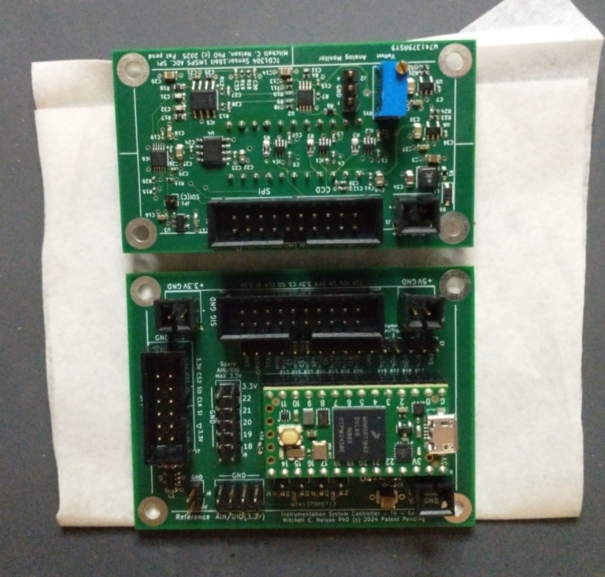
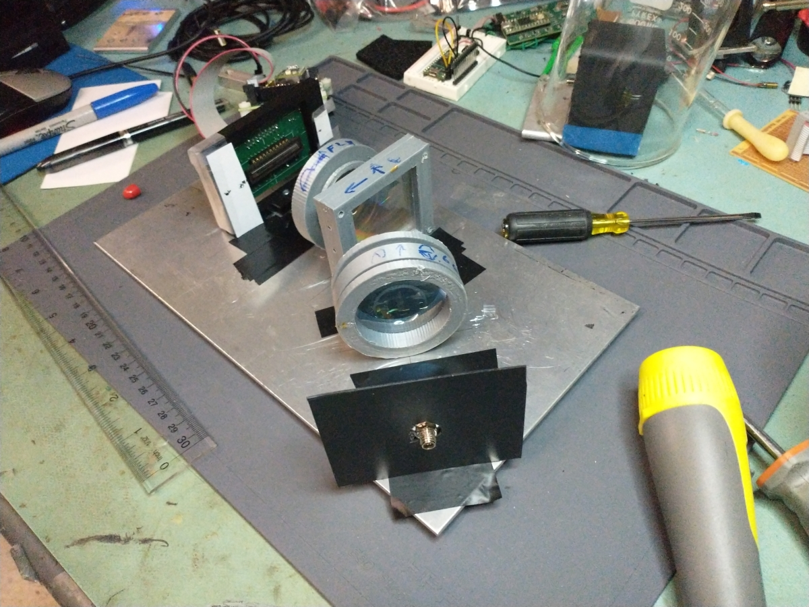

# TCD1304-SPI
TCD1304 with reproducible, linear response, 16 bit, SPI

  

## Introduction
We are constructing this repo now, stay tuned for updated files.

Reproducibility is one of the vital elements of scientific measurements.  For a spectrometer, reproducibility in a practical sense means linearity.  Here we will provide ecad files, gerbers, firmware and python library and user interface for a linear CCD system that has linear response and provides reproducible results. 

The challenges to achieving linearity and reproducibility in a linear CCD sensor include aspects of both device physics and electrical design, the latter being related to the characteristics of signals that correspond to sharp spectral line.  The present design was devloped specifically to address these issues.    But first, let's demonstrate what the problem looks like.

### The commerical instrument
The following are fluorescent lamp spectra collected with one of the most popular commercial CCD spectrometers at different exposure times. We divide intensity by exposure time. So, all of those curves should lay on top of each other. To make things more clear, the third graph shows the ratios of the heights of three of the peaks from the spectra. The peaks heights are not proportional to the exposure time, and even the height of one peak compared to another changes when you change the exposure time.

### The new linear response TCD1304
Here is similar data to the above, but no collected with the TCD1304 system from this repo.  BOM is about $150, optics around $200 from Thorlabs or ebay. The processor is a Teensy 4.0

As you can see, the curves now do lay over each other, except where it saturates at longer exposure times. And the relative peak heights are pretty flat, again until one of the peaks saturates. That is what you want if you want to be report spectra when you publish your research.

### Contents of this repo
This repository at present contains the preliminary gerbers, schematic and BOM.  We will be adding updated design files, firmware, python code and a detailed explanation of how this works and in particular how we identified and solbed the linearity problem.

If you have questions in the meantime, please feel free to contact me.

Meanwhile, here is a picture of the first board set (sensor and controller), and assembly of the spectrometer.  As can be seen in the above, the spectrometer has similar resolution to the expensivie commercial instrument but with the advantage of good linear response and less than 1/10 of the cost.  There are some minor updates since the first boards. Those will be added to this repo soon along with firmware, a header only library for teensy arduino, and a python user app and library.

