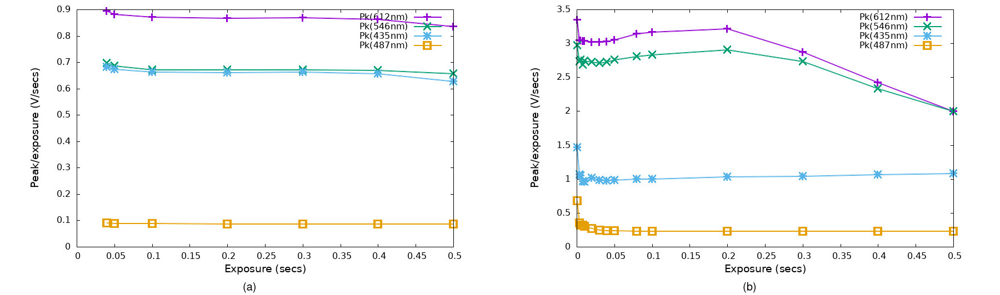
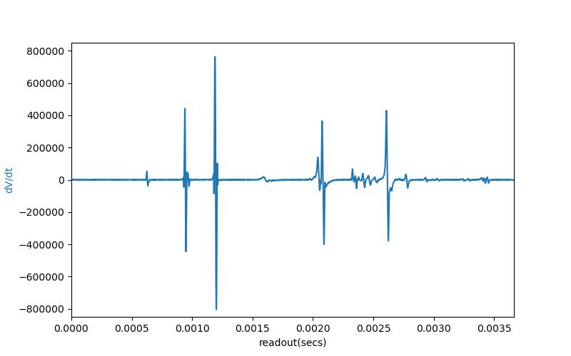

# TCD1304 Sensor with Linear Response and 16 Bit Differential ADC

#### Table of Contents
- [Introduction](#introduction)
	- [SPI Instrumentation Project](#-the-spi-instrumentation-project---open-instruments-for-open-science)
	- [Permissions](#-permissions-no-warranty-or-guarantee-and-etc)
- [Contents of this repo](#contents-of-this-repo) 
- [Getting it all up and running](#getting-it-all-up-and-running)
	- [Assembling or obtaining boards](#assembling-or-obtaining-boards)
	- [USB connection](#usb-connection)
	- [Loading the firmware](#loading-the-firmware)
	- [Setting up and running the python codes](#setting-up-and-running-the-python-codes)
- [On Linearity and reproducibility in CCD spectrometers](#on-linearity-and-reproducibility-in-ccd-spectrometers-with-data)
- [Origins of non-linearity and electrical characteristics of CCD spectrometers](#origins-of-non-linearity-and-electrical-characteristics-of-ccd-spectrometers)
- [Setup for linearity testing](#setup-for-linearity-testing)
- [Spectrometer construction](#spectrometer-construction)
- [Electrical design (a tutorial)](#electrical-design)
	+ [TCD1304DG electrical characteristics](#tcd1304dg-electrical-characteristics)
	+ [Signal conditioning](#signal-conditioning)
	+ [Interfacing to an ADC](#interfacing-to-an-adc)
	+ [SPICE model for the 16 bit sensor board](#spice-models-for-the-16-bit-sensor-board)
	- [Gate driver and analog signal integrity](#gate-driver-and-analog-signal-integrity)

## Introduction

This repo offers a Linear-CCD (LCCD) sensor device based on the TCD1304DG designed specifically for linear response and reproducibility in spectroscopy and scientific imaging.  We provide (a) files for fabrication including gerbers and BOM, (b) firmware as an Arduino "sketch" and a header-only C++ library, (c) host software in Python that can be used as a class library or command line interface with realtime graphics, (d) this README with test results and tutorials for electrical and optical design, and (e) a collection of SPICE models that we used to develop and test the design. (KiCAD files will be added after the initial roll out.)

We provide two implementations, a sensor board that operates with our [Teensy 4 based instrument controller](https://github.com/drmcnelson/Instrumentation-Controller-T4.0-Rev3), and an All-In-One device with sensor and MCU on back and front of the same board.
The sensor board offers very low noise with a 16 bit differential input 1MSPS ADC, and mechanical isolation.
The single board device, with sensor, electronics and controller all on one board, offers similar performance in terms of linearity to the two board system, but with 12 bit precision (and fewer parts) using the on-board analog input of the T4. The firmware and Python codes have been tested with both devices.

Reproducibility for CCD spectrometry, in a practical sense depends on linearity, and specifically, linear response independent of line shape.  This is a significant challenge to electrical design, as will be explained. Absent this kind of linearity, both normalized and relative peak heights become sensitive to exposure time or light intensity and the dependence can be non-monotonic.  We will show you examples of this in popular commercial instruments, side by side with results showing that this kind of linearity is achieved in the present design.

Having established the "facts on the ground", we then offer our perspective on the challenges to linearity and reproducibility in CCD spectroscopy and imaging, including the nature of the signals produced and certain aspects of device physics for the detectors.   We then explain our approach to designing a system that addresses these issues with the help of some detailed SPICE modeling.

Construction of the spectrometer used for testing the new sensor is described below [(click here)](#spectrometer-construction).
We use a 1200/mm grating and 200μm entrance slit with a focal length of 2 1/4".
Total cost of materials for the spectrometer is under $400, including the electronics (this repo), optics and mechanical parts.

As noted, we operate the sensor board using our newly updated ***Instrumentation Controller*** based on the Teensy 4, with its NXP i.MXRT 1060 ARM7 MCU [(please click here)](https://github.com/drmcnelson/Instrumentation-Controller-T4.0-Rev3).
The T4/NXP platform provides a flexible timing generator (FlexPWM), fast CPU clock (600MHz) and high-speed USB (480 Mbps).
The former is helpful for optimal operation of the TCD1304DG. 
The latter enable signal averaging and 100fps transfers for the large 3664 pixel frames produced by the TCD1304DG.

The firmware, written for the T4, includes a header-only library to operate the sensor, and a "sketch" file (Arduino source code, similar to C++) that implements human readable commands and responses, operates the sensor to produce frames by clock or hardware trigger, and sends the data back to a host computer.
The controller can be programmed in the Arduino IDE and the code is easily modified to reprogram or reconfigure any or all of the above.

The Python code can function as a user interface or as a Class library.  When invoked directly, the code presents a graphical monitor and command line interpretor with human readable commands. When used as a library from another program (see "import"), the code provides a Python Class that implements both high and low level member functions to work with the device.  The design emphasizes simplicity and performance, again with anticipation that scientist users can modify the Python code to their purposes.   The command "help" lists detailed help text from the controller and from the Python code.

The fab files and code provided in this repo, and in the controller repo, plus some cabling and a host computer, should be sufficient to assemble the boards and get your detector system up and running.  Feel free to contact me for consultation or pre-assembled boards (time permitting).  And needless to say, donations are very much appreciated, please the sponsorship button above.

###  The SPI Instrumentation Project - Open Instruments for Open Science
The contents of this repo are part of our effort in ***Open Instrumentation for Open Science***.  

We believe that access to doing great science should not be limited to those privileged in funding and affiliation and should not be held ransom to the extractive practices of companies that sell scientific instruments targeted to those most well funded. And, compared to those expensive instruments conceived in corporate offices, you may feel better served by instruments developed by other scientists who actually use them and have decades of experience designing professional instrumentation. The designs we provide can often be built at about 1/10 of the cost of the commercial instrument.  In our own research, we are typically able to do more with these boards that we build and understand than we can with the expensive commercial instruments.

At this writing, we have received requests and helped scientists working in Europe, Africa, India, Canada and the USA.

One very important way that you can help underfunded scientists is by clicking the "Sponsor" button at the top of this repo.   The funds go to helping to make more instruments more available to more scientists around the world.

If you would like to sponsor and receive boards for sponsoring, please contact me.

###  *Permissions, no warranty or guarantee, and etc.*
Permission is hereby granted for you to build and use these boards and codes in your lab and for your personal use.
Please cite appropriately if you use these in your published work.

Please contact me if you need/want:
<ul>
<li>
Pre-assembled boards
</li>
<li>
Customization, advice, etc.
</li>
<li>  
Permission for use in a product or other commercial effort
</li>
</ul>

And of course, no warranty or guarantee is given whatsoever.  We did our best.

### Contents of this repo
This repository at present contains the preliminary gerbers, schematic and BOM, plus preliminary firmware and python code and selected SPICE files.  We plan at least one update for the firmware and we plan to add KiCAD files.  The README (this file) provides results of testing and some explanation of how things work.

If you have questions, please feel free to contact me.  

***
## Getting it all up and running
This sensor board is intended to be used with our new [Teensy 4 (T4) based controller](https://github.com/drmcnelson/Instrumentation-Controller-T4.0-Rev3). 
The files provided here (gerbers and code) and in the controller repo, plus some trivial cabling and a host computer (we recommend Linux for the best frame rate perfomance) should be sufficient to build and operate the boards. 

### Assembling or Obtaining boards
You can assemble the boards yourself, or if you prefer, please feel free to contact me for pre-assembled boards.

If you want to assemble your boards, and this is your first time assembling an SMT board, search for an introduction to DIY SMT assembly, [for example here](https://www.kingfieldpcb.com/essential-tips-for-diy-smt-assembly/).

Here are some notes on how we do assembly in our shop.
We order PCBs from AllPCB, JPLPCB, and PCBWay. We usually order parts from Digikey, but we also use Mouser and Newark.  We use Chip Quik no-clean solder paste in a syringe dispenser with fine needle tips that we order separately. And we use a reflow oven that we purchased through ebay for about $200, and sometimes we use a temperature controlled rework heating stage that we purchased through Amazon.

### USB connection
We recommend using a powered USB hub with switches to turn individual USB devices off and on. When you shop for this, make sure it can supply at least 1A per port.  For example, a powered 7-port USB hub should be able to supply at least 1A x 5V x 7 ports = 35W.  

### Loading the firmware
After the boards are assembled, you will need to install the Teensy board in the controller, and compile and load the code into the Teensy.  You will most likely want to use the Arduino IDE for this.  Teensy is well integrated into the IDE. [See here for setup instructions.](https://www.pjrc.com/teensy/td_download.html)   The Teensy needs to be connected by USB to your host computer for this step.

The firmware codes are found in the repo in the Firmware/ subdirectory

(In the following, the "250901" in the directory and file name, is the date of this version of the firmware.  If there is a newer version when you read this, use that one.)

    TCD1304Device_Controller_250901/
    
      TCD1304Device_Controller_250901.ino  - The Arduino program with the CLI
    
      parselib.cpp    - The string parsing library for the CLI
      parselib.h
      TCD1304Device.h - The header-only C++ library for the TCD1304 with FlexPWM

The Arduino IDE requires that the "ino" file and directory have the same name.

If you want to customize the firmware, it is recommended to create a new directory, copy the files to that directory and rename the ino file per the above.

After installing the Arduino IDE and Teensy package, you should be able to double click on the ino file to start an IDE session, or start the IDE and navigate to the directory and open the file.  

### Setting up and running the Python codes

Python codes and Bash scripts for operating the TCD1304DG sensor and working with the data, all under Linux, are provided in the repod under the subdirectory Python/.

The codes have been used with the Fedora Cinnamon Spin, which you can [download from here](https://fedoraproject.org/spins/cinnamon).   This uses xorg rather than Wayland, the desktop is Win7-like and it is easy to work with terminal windows. The codes may work with other distros, we have not tested them.  

#### Installing the Python environment

The command to install the Python environment and libraries used by the codes is as follows (in Fedora, use apt-get or aptitude in Ubuntu):

    $ sudo dnf install python python-numpy python-scipy python-matplotlib python-pyserial
      

#### Setting up the user software for the TCD1304 boards
To setup the Python codes from this repo, unpack or download the files from the repo's Python subdirectory to a directory on your Linux machine; somewhere under your personal user directory works just fine.  And, set the permissions to allow execute  (chmod a+x *.py, and chmod a+x *.sh).

Here is a list of the files provided in the Python directory

    TCD1304Controller.py   - User interface and Class library
    
    Accumulators.py        - Libraries used by TCD1304Controller.py
    GraphicsWindow.py
    GUIWindow.py
    TextWindow.py

    DataReader.py          - Offline library and graphics utility

    TCD1304.help           - Output from the help command
    
    SetupPATH.sh           - Adds the code directory to PATH
        
    GraphTCD130Spectrum.sh - Offline graphics using DataReader.py
    
    Calibration2           - example wavelength calibration

 

#### Running the user command interface with real-time display and post collection shell scripts

You will want to add the directory for the Python and bash scripts to your PATH. You can do this by adding the following line to your .bashrc.  Alternatively you can run this from a command terminal, but you would then need to do it each time.  Note that the command begins with ". "

    $ . pythoncodesdirectory/SetupPATH.sh
  
After all of the above, make sure that your sensor controller is connected to your compute with a USB cable, that the cables are connected correctly if you are using the two board implementation, and then turn on the power and wait about 1/2 minute.

Now you can run the controller program.

    $ TCD1304Controller.py

The controller should open a grahics window.  The desktop will look something like this:

Notice that in the console window, you have a prompt.  This is the command line interface to running the sensor device.  Enter the command "help" to get a listing of the commands.

Some of the commands are implemented in the Python code, the remainder are passed through to the sensor device.  The CLI also supports scripting and can execute shell commands.

There are two operating modes for the sensor, "frameset" for short exposure times where the SH gate and readout have to overlap, and "single" where the exposure time is longer than the time needed for readout and managed by a separate hardware timer. The device can run in triggered mode for framesets or timed singles or simply singles.

The firmware is tested but we are adding some features to build up a more intuitive layer of commands.  At present the command set is more like "nuts and bolts".  There is sometimes an advantage to being able to work with an instrument at a low level, but it requires knowing a little bit about what is happening inside.

Data collection is run in two or three steps depending on the mode of operation. For frameset, the clock is built into the timing configuration for the gates. For clocked exposures we can run the commands **setup frameset...** and **start frameset**, or **setup single**, **setup timer...** and **start timer**. For triggered operation, we can follow any of the setup commands by **setup trigger...** and **start trigger**.  After data collection is complete, we can use the command **save filespec**.   The data is buffered in a queue and the queue is cleared when the data is retrieved and saved to disk.  There is a clear command, or one can save to a file called temp or junk to clear it.

The Python user utility also supports shell commands, scripting, loops and string substitution.  See the help for details, and see the sample script files including in the distribution.

A Python program, DataReader can be used as a library to work with data file or as a standalone program for graphics.  The command line accepts python language states to define x, y, y2 and etc.  See the bash commands included in the distribution for examples.  
 

***
## On Linearity and reproducibility in CCD spectrometers (with data)

In this section we illustrate some of the challenges in linearity and reproducibility in CCD spectrometers using data collected with the present design sensor as a reference and comparison for data collected with  commercial instruments.

Linear response, for a spectrometer, means that the  measured response S is proportional to the number of photons P impinging on the detector, generally within a specified exposure time. For each pixel n, we expect that Sn = cn Pn + Dn, and ΔSn = cn ΔPn where cn is a constant and Dn represents the dark signal for that pixel.

When the instrument is linear, measurements can be related to intensity or number of photons, ratios of peak heights S1/S2 remain constant and spectra can be added or subtracted meaningfully (the sum of two spectra S = Sa + Sb with exposure times ta and tb provides the same result as a single spectrum collected with exposure time t = ta + tb).   In other words, linear response is important in being able to report measurements that are both meaningful and that can be feasibly and reliably reproduced by other researchers.

There are a few ways in which spectrometer response can be non-linear. The most important and most common are related to electrical limitations in bandwidth or slew (dV/dt) or to charge being held over to the next frame or from pixel to pixel during readout.  Where information is not lost or made ambiguous by the non-linearity, there might exist a numerical correction (in a mathematical sense).  Generally, it is far easier and far more reliable to simply use an instrument that is already linear.

### Linear response and line shape
The following are fluorescent lamp spectra, from the present design and from a commercially produced spectrometer (Flame-S, Ocean Optics).  Notice that narrow spectral lines are stronger in the spectrum produced by the present design. The effect becomes especially clear at shorter wavelengths.  (For a gas phase lamp with δλ/λ broadening, lines are naturally sharper at shorter wavelengths.)

 

<i>
Fluorescent lamp spectrum, (a) new sensor and (b) commercial instrument.
</i>

### Linear response and exposure time
The following data show the response of the instrument for three narrow spectral lines and one broad spectral line, with exposure time varied from 10ms to 0.5sec.  The response is measured as volts divided by exposure time.  If an instrument is linear, these curves should be flat.
As noted above, for data to be meaningful the response curves should at least be monotonic and strictly increasing.

 

<i>
Normalized response for (a) the present design and (b) the commercial instrument versus exposure time.
</i>

The present design shows approximately linear response - apart from the first points were the SNR is low and the last point where the two strongest peaks have reached saturation.
The response of the commercial instrument (right or bottom) depends on line shape, and for the sharper lines is neither linear nor monotonic even where far below saturation.

### Peak height ratios with line shape and exposure
The following shows ratios of peak heights derived from the above data. The data is displayed as fractional change relative to the maximum of each curve.  We quite reasonably expect that for a reliable instrument, ratios of peak heights should normally, not change when we change intensity or exposure time.  The present design does indeed show roughly constant peak height ratios (within noise).  The commercial instrument shows strong non-monotonic changes in ratios of peak heights.

 

<i>
Peak height ratios (normalized) for (a) the present design and (b) the commercial instrument versus exposure time
</i>

### Baseline integrity
Baseline or background subtraction is often a necessary step in extracting intensity data from spectra.  There are a number of ways to do this, for example using dark spectra or regions of spectra where the experiment produces little intensity.  The former assumes the background is independent of the signal of interest and the latter assumes background is dominated by the dark noise of the detector rather than light.

The following shows a fluorescent lamp spectrum from [Wikipedia](https://upload.wikimedia.org/wikipedia/commons/8/83/Fluorescent_lighting_spectrum_peaks_labelled.png).
Notice the anomalous baseline to the blue side of the sharp peak at 631nm.  The shape is not like dark noise nor any sort of room lighting. We can speculate about its origin, but the important point is that it is not easily corrected.

Fluorescent lamp spectrum. 
<a href="https://commons.wikimedia.org/wiki/File:Fluorescent_lighting_spectrum_peaks_labelled.png">Original:  Deglr6328 at English WikipediaDerivative work:  H Padleckas</a>, <a href="http://creativecommons.org/licenses/by-sa/3.0/">CC BY-SA 3.0</a>, via Wikimedia Commons

## Origins of non-linearity and electrical characteristics of CCD spectrometers
The following provides some insight into how the above phenomena emerge in   a CCD spectrometer (or imaging system).  We start with how the signal is produced and retrieved from a CCD detector.

A simple way to think of a CCD is as an array of photodectors that produce charge when exposed to light, backed by a kind of shift register that preserves the quantity of charge while it is shuttled along the register in response to a clock signal. At the last such pixel, charge is converted to voltage and presented at the output pin.  The response up to this last step, depends on  the combined transfer efficiencies from photodetector to readout register and then along the length of the readout register.

An important "takeaway" is that a CCD records a discrete spatial patten of light induced electric charge and on readout converts it to a discrete time series of voltages.  In this way, a sharp spectral line becomes a short pulse in time.  And that is what makes spectroscopy different from other signal acquisition scenarios.

In designing circuits for acoustics or radio frequency work, we might think in terms of a Nyquist frequency and we might accept some small non-linearity for signals approaching this "cutoff". But in a CCD spectrometer (or imaging system) a full scale step in voltage from one sample to the next can be a legitimate feature that has to rendered to a meaningful digital representation. We can think of this in terms in of bandwidth or dV/dt.

The following shows the Fourier transform of the above spectrum (blue), and on the second "y" axis we graph a response curve (orange) calculated for a simple low pass filter (single pole) with cutoff frequency at 1/2 of the sample rate much. As you can see, naive filtering produces about 10% attenuation for high frequency components that may be important for linear response to narrow spectral lines.

The following shows a perhaps more intuitive way to look at this, by graphing the spectrum as its first derivative, dV/dt.   Now we can see clearly that anomalous attenuation in the commercial instrument seems to follow dV/dt.  This is suggestive in that it corresponds  directly to a selection parameter for OPAMPs, the maximum slew.  We will show some detail about how this works in the following section.

Before leaving this topic, we should mention another effect.
The CCD sensors used in spectroscopy can be 2K to 4K in length.  After  N steps along the CCD, single step transfer efficiency ε becomes εN.  Lost charge at each step appears in the next pixel.  There can be a similar effect on a frame to frame basis.  At typical transfer efficiency 99.99%, this should be a small effect even after order 1K pixels, but data are suggestive of these effects is common.

### Circuit models with filtering and effects of large dV/dt
We are going to skip ahead and present some SPICE models that demonstrate the effects of bandwidth and dV/dt. We use the actual spectrum from the linear sensor board as input.  These are single ended to simplify the presentation. (Our 16 bit board is differential with a differential input ADC.)

First, here is a circuit that produces good linear response. This is similar to the design from our single ended "All In One" sensor board.  The spectrum (green trace) is exactly overlaid by the voltage on the sampling capacitor (red trace).

Now we introduce a low pass filter. We set this aggressively to produce an effect that is easy to see when graphed in this way.  The filter produces attenuation for the sharp lines, but the effects is similar for all of the sharp lines.

And finally, here is what happens when the circuit is not able to respond to large dV/dt.  The change in the circuit is a slower OPAMP.  Now we see stronger attenuation of the sharper lines in the blue, as expected based on our analysis above.

---
## Setup for linearity testing

The equipment list for our linearity study is as follows.  Construction of the spectrometer is described [here](#spectrometer-construction)

<ol>
<li> Spectrometer</li>
<li> Fluorescent lamp</li> 
<li> Neutral density wheel filter for attentuation (individual filters can be used instead)
<li> 200μm optical fiber
<li> Miscellaneous mechanicals to hold the lamp, ND filter and fiber.
</ol>

Once set up and aligned, the mechanical configuration remains fixed through the duration of the measurements.  The ND filter wheel is adjusted and left in a fixed setting for each dataset, each comprising a set of exposure settings.  

## Spectrometer Construction
The following describes the instrument that we used to test the new sensor device.  The following pictures show (a) the "optical bench", (b) housing, (c) sensor board, and (d) the controller.  We have a center wavelength of about 520nm and cover the range from about 290nm to 740nm.  Optical resolution with a 200um slit is about 3nm.

  
&nbsp;
  

  
&nbsp;
  

The parts list for the above is:

<ol>
<li>Grating, 1200 grooves/mm, Thorlabs GT50-12, $250</li>
<li>200μm entrance slit, DIY-Optics.com, ~$30</li>
<li>Plano Convex lenses (50 to 60mm fl for this design), ebay, ~$20</li>
<li>SMA905 fitting, Amazon, Digikey, Mouser, Ebay ~$15</li>
<li>Aluminum plate, OnlineMetals.com or Amazon</li>
<li>Mounts produced with a 3-d printer</li>
<li>TCD1304 sensor board and controller from this repo, with cables</li>
</ol>

Detailed discussions on designing a spectrometer are easily found by web search. We will mention a few important highlights.  Here is the geometry for reference.

First, let's choose a center wavelength.  For a grating with line density G (in lines/mm), the 1st order diffracted wavelength as a function of angle is given by

λ0 G = sin θin + sin θout. 

Setting the exit angle to zero (0), our 1200l/mm grating with a center wavelength at 500 nm gives us an incident angle of about 37 degrees. That happens to be the blaze angle for our grating, So, that works out very well.

The range in wavelength is set by the size of the detector and the focal length of the second lens,

G Δλ = cos(θout) LD/LF

where LD is the length of the active region along the detector and LF is the focal length. In our geometry (θout = 0)
with a 1,200 l/mm grating, 30mm detector and 55mm fl exit lens,  we expect should gives us a range of about 450nm.

For setup and alignment, the slit and sensor should be positioned at the foci of the lenses and the sensor should be parallel to the grating. (Note that the sensor is actually 0.7mm behind the face of its glass window.)
You can use a flashlight and fiber as input to align the device. It should look like a well focused rainbow on the face of the sensor.
An important concept is that the instrument in a sense, images the slit onto the detector.

In this geometry, we have a magnification factor roughly equal to the ratio of the focal lengths of the lenses.

M = cos(θin) LF/LC

That is about 0.8 for our geometry.  The TCD1304 pixel size is 8μmx200μm.  So a 200μm slit works makes good use of the pixel height but we give up some resolution.

δλ = cos(θin) wslit / G LC

where is wslit is the slit width.  For  wslit≈200μm and LC≈60mm, we expect δλ≈2.2nm.

In the preceding sections, you can see spectra from the instrument and indeed, the range is about 450nm and the narrowest line widths are in the range of 2nm.
Note that the wavelength range and pixel density set an effective limit on resolution.  For this instrument we have about 0.12nm per pixel.  A 25um slit would give an optical resolution of about 0.28nm, but spread across only 2 pixels.  

 

***
## Electrical design

We now describe some of the elements of circuit design for a CCD based spectrometer (or imaging system).
This will be something of a tutorial.  The idea is to support open science.  That includes being open about what you need to know to design something like this for yourself. We assume some basic knowledge of electronics.  The "attentive reader" will note that we make extensive use of SPICE models.

We include a set of SPICE models in the [SPICE subdirectory](SPICE).  These form the basis of most of the illustrations shown in this README.

We start with characteristics of the TCD1304DG and then proceed through signal conditioning to the ADC, gate drivers, and power architecture.

The reader may also be interested in reading the description in our repo for the original "All-In-One" board, [here](https://github.com/drmcnelson/Linear-CCD-with-LTSpice-KiCAD-Firmware-and-Python-Library).

### TCD1304DG electrical characteristics and operation
The TCD1304DG datasheet can be downloaded [here](https://toshiba.semicon-storage.com/us/semiconductor/product/linear-image-sensors/detail.TCD1304DG.html).
The device architecture is shown in the following figure found on page 2 and labeled "Circuit Diagram".  We see a photodiode array, shift gate (SH), integration clear gate (ICG), CCD analog shift register and signal output buffer (OS), with pins SH, ICG, master clock ΦM, and OS plus power and ground.

TCD1304DG "circuit diagram", from page 2 of the datasheet.

Operation of the device is shown in the following timing diagrams which can be found on pages 6 and 7,

TCD1304DG timing diagrams, (a) coherent shutter and exposure, (b) "electronic shutter function", from page 6 and 7 of the datasheet.

As depicted, exposure begins and ends on the trailing end of pulses asserted on the SH pin, readout begins following assertion of SH and ICG together, and thereafter, data is clocked out at 1 pixel per four cycles of the master clock ΦM.

A table of capacitances for these pins is found on page 5. Without going into the details of how CCDs are constructed [(see here](https://www.chronix.co.jp/chronixjp/material/pdf/chronix/CCD-Image-Sensor-English.pdf)), we can infer that the large capacitance of the SH and ICG pins are consistent with these playing an essentially direct role in harvesting charge in the device. The master clock capacitance is suggestive of an input to a logic network.  Four clock cycles per pixel readout further indicates a 4 cycle type CCD register.  This informs our design for the gate drivers.  However for now, we focus on the analog signal conditioning part of the design.

TCD1304DG "gate capacitance", from page 5 of the datasheet.

Electrical characteristics of the TCD1304 output are described on page 3 of the datasheet (excerpted here). We include the diagram from "Note 8" to indicate the origin and direction of the signal in volts.  The output is a negative going signal from fixed DC level VOS typically 2.5 volts (var 1.5V to 3.5V) to VOS -0.6V  at saturation (min -0.450V) and the output impedance is typically 500Ω (max 1kΩ).

 

### TCD1304DG noise
The TCD1304DG datasheet reports dark noise as 2mV (typ, max 5mv) with 10 ms exposure. The following shows our measurement of the dark noise as a function of exposure time using our 16 bit sensor board.  As expected, dark noise is linear in exposure time. But there appears to be a floor for dark noise at about 0.6mV, which it approaches for exposure times less than 20ms. 

Dark noise vs exposure time in the new sensor device.
(Electrical noise with sensor removed is ~14uV)

Removing the chip from the board, the electrical noise is about 14uV. So it seems that the dark noise signal at 0.6mV really does originate in sensor chip.

Dark noise is known to be related to temperature with the usual Boltzmann dependence.
Some have reported reductions in noise by a factor of 4 with modest cooling to around 4C.

### Signal conditioning
For best performance we want to match the output of the TCD1304DG to the input range of our ADC.  For the two board configuration, this will be a 16 bit high precision ADC with a differential input and 4V reference. For the "all-in-one" board this will be the 12 bit analog input of the MCU with a range of 0 to 3.3V.  In either case we need to shift, flip and amplify the output from the sensor to match the input range of the ADC.

#### Single ended signal conditioning
The following shows a reasonable approach for the front end circuit. We use a dual OPAMP, the ADA4807-2, slew 225μV/s, input noise 3.1nV/√Hz, 0.1pA/√Hz, and input capacitance 1pf. The first unit is configured as a voltage follower to take care of the large variation in source impedance and the second is setup as an inverting amplifier with offset.  This gives us reproducible gain and it provides linear response with good noise performance.

#### Low noise differential signal conditioning
We use the following approach for 16 bit precision.  Similar to the above, the first unit is configured as a follower but the second is configured as an inverter with offset and unity gain.  The two outputs together provide a differential signal.  In implementation we follow this with a fully differential amplifier (FDA) and a differential input ADC.  For gain we get a factor of 2 for free and make up the rest in the FDA.  Cancellation between the differential pair improves noise performance for our mixed signal environment.

#### A don't-do DIY circuit
The following shows a design that appears from time to time in DIY postings.  The inventor typically omits the voltage-follower and instead goes straight to the inverting amplifier.  This of course makes the sensor part of the gain equation, G = R2/(R1+Rsensor).  But the sensor impedance as we noted above, varies from 500Ω to 1kΩ.  If the inventor is aware of the issue, they might make R1 very large to drown out the contribution from the sensor.  But to have gain, R2 has to be even larger, typically 2 to 5 times R1.  Now come the problems. 

With large values for R1 and R2 there is a large parallel resistance that dominates the noise density at the input, vn ≈ 0.13 √R// [units nV/√Hz] (see "Johnson noise").  This creates a trade-off between bandwidth and precision.
And with a very large R2, the pole formed with the input capacitance of the OPAMP at fp = 1/(2πR2Cinp) moves to lower frequency and can be within the bandwidth needed for readout.  The amplifier may be unstable and the data unreliable.  All of this is for a net savings of about $3 for leaving out the voltage-follower.  If you need to report spectra with reproducible intensities, it might be best to avoid devices that take this approach.

### Interfacing to an ADC
The present application requires analog to digital conversion at rates from 200KSPS to 1MSPS and between 12 and 16 bit precision depending on your specific needs. This put us in the domain of the SAR type ADC (successive approximation register) [see here](https://www.analog.com/en/resources/analog-dialogue/articles/the-right-adc-architecture.html).  There are some important details to using a SAR type ADC and moreso for our application.  This involves some nuance, so we start from the basics.

#### Spice model for ADC input
The SAR architecture comprises a sample and hold (S-H) circuit followed by a comparator and DAC which are operated by internal logic to implement the successive approximation algorithm.  The S-H circuit is seen by the driving circuitry as the input to the ADC.   In a simplified sense, it looks something like the following but with the switch driven by a clock.

 

We can implement this in a SPICE model as follows. For purposes of illustration, we include an ideal voltage source as the input.  C1 is the sampling capacitor, S1 is the switch that connects C1 to the input, and S1 is controlled by the clock V1.  When S1 opens, the voltage on C1 is converted to a digital representation by the SAR engine.  The time during which S1 is closed, is called the sampling window.
(Values for the internal resistance (Ron) and capacitance (C1) for a given ADC are usually available in its datasheet.)

 

ADC model with ideal voltage source.  Green = input, blue = sampling capacitor, grey = sampling window.

#### Factors effecting precision
For n bits of precision and full scale range Vfs, the voltage on C1 at the end of the sampling window has to be within 1 part in 2n of Vfs.
The input always has some series resistance, in this case Ron.
Therefore the sampling window has to be at least as long as n x ln(2) x Ron x C1.  

Voltage noise of a capacitor is <i>vc</i> = √(kT/C). 
For n bits of precision, we need <i>vc</i> < Vfs/2n.
The 30 pF sampling cap shown in the model produces about 11μV of noise and 1/216 = 15μV.

When you select an ADC, make sure to look for these parameters in the table of electrical characteristics or the equivalent circuit for the input in the datasheet.  Also don't forget to look at the graphs for SNR.  Often the SNR quoted in the beginning of the datasheet is less than the whole story.  And don't forget to look at PSRR.  And do follow the guidelines for selecting the voltage reference and for layout.

#### ADC kickback
Kickback describes what happens when the switch closes to connect the input to the driving circuit.

In the following we drive the S-H from a voltage follower instead of the ideal voltage source.  Now when S1 opens or closes we see spikes (circled) on both voltages and in the current through R1. This is the famous ***"<u>ADC kickback</u>"***. It arises in the current needed by C1 with the sudden change in voltage when the switch closes.

 

ADC model driven by OPAMP follower.  Green = out, blue = sar cap, grey = sampling window, red = current through R1.

 
 #### Charge reservoir as solution for kickback
The following shows the recommended method for driving an ADC. A cap C2 is added in front of the ADC to act as a charge reservoir for C1.  As can be seen, charge for C1 now comes from C2 and the voltage on C2 is managed by a much smaller current through R1.  There is no discernible kickback in V(out) nor in the current through R1.

 

ADC model with recommended driver, charge reservoir C2.  Green = out, turquoise = adc in, blue = sar cap, grey = sampling window, red = current through R1, orange = current through C2.

A perhaps simpler way to illustrate the idea is as follows.  The arrows indicate the current flow to maintain the charge on the reservoir and what happens when the switch is closed.

 

This looks like a low pass filter, but the components are chosen a little differently.
C2 needs to be large compared to C1 and R1 needs to be tuned between the current capacity of the OPAMP and allowing C2 to track the input. We make extensive use of SPICE modeling to check designs for response and precision.

#### dV/dt versus charge reservoir

You may recall our discussion about dV/dt and sharp spectra lines near the top of the README.  Here is what happens when a large dV/dt meets the charge reservoir that we added to support the sampling capacitor in the ADC.   The circuit in this example is a "full feature" single ended model from CCD to ADC.  The input is a pulse, and a little bit extreme with a 2ns rise time.

Notice that we now have a large current through R1 coincident with the leading and trailing edge of the pulse.  The current through C2 is as before.  So, large dV/dt meets cap serving as charge reservoir and produces a new kind of kickback.

Effect of dV/dt in charge reservoir.  Green = out, turquoise = sar cap, blue = sar cap, grey = sampling window, maroon = current through C2, red = current through R1.

The following shows a method for mitigating the new kickback.  We simply slow the pulse a little bit with a low pass filter in the feedback loop.  This has to be tuned somewhat to put the current within the capabilities of the OPAMP but still allow C2 to recover fast enough to meet the design requirements for precision.  We are able to get 18 bit precision in models. Real spectra are less demanding and our precision spec is 16 bits.

 
 
### SPICE models for the 16 bit sensor board

The following are screens from two of the spice models that we used in designing the sensor board.

#### Differential signal path and ADC
This is the [SPICE model for the analog signal path with ADC](SPICE/TCD1304DifferentialBuffer.asc).
The input is configured as a short pulse to stress the kickback management.  The second graph shows the voltage on the sampling capacitor converging to the input voltage within the sampling window.  Convergence is better than 16 bits.

SPICE model for the 16 bit sensor board, analog section.
 
Red = sensor, Green = adc inp, turquoise = Cs+ (sar cap), blue = current through R11.

Convergence of V(Cs+) to input voltage for the 16 bit sensor board.
 
Red = sensor, Green = adc inp, turquoise = Cs+ (sar cap).

### Gate driver and analog signal integrity

Issues that require careful attention in designing the gate drivers, include the fact of the very large capacitance of the SH gate, the role of this gate in collection charge from the photodectors into the readout CCD register, and then an electrical effect in the rest of the circuit wherein noise from the gate drivers appears on the power rails.

The following shows a SPICE model for the gate drivers. These generate a pulse on their power rails, so we power these from a separate voltage regulator.  The model includes a current limited supply for the LDO with inductor, in place of the filtered current limited 5V supply on the actual board.

Gate drivers and pulse generation on the power rails.
 
Blue = V(sh), Green is V(icg), Red = (V(ccb)-4.0492) x 1000, Grey = I(R6)

Note that the trace for voltage pulse on the supply side of the gate drivers is scaled times 1,000.  This puts us well within our power supply noise budget for the analog signal path.

Now lets take a look at another way in which the gate driver effects performance in the analog section.  In the following figure we toggle an LED on and off in synchrony with the gate driver, vary the duration of the pulse on the SH gate and graph the fraction of signal that appears in the next frame after the LED is off.

Notice that the "carry-over" signal falls off with the same time constant as the RC formed by the SH gate (600pF) and our series resistor (200).  At 1 usec the contamination is better than 1 part in 10,000 and so carry-over is small compared to dark noise.  In our case, our gate driver provides 25mA, so the time constant really is set by the RC.

This is a caution that the gates should not be driven directly from low current sources where the time constant will be current limited, for example from the digital I/O pins of a microcontroller, but rather from a proper gate driver that can deliver enough current to achieve a sufficiently rapid charging curve on the SH pin.

LED spectrum, orange curve is with LED off.
Carry-over appears with inadequate gate drive.

 

Carry-over decreases with SH pulse width.

