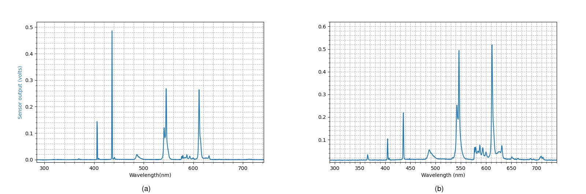
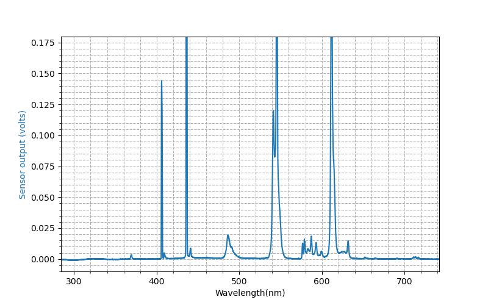
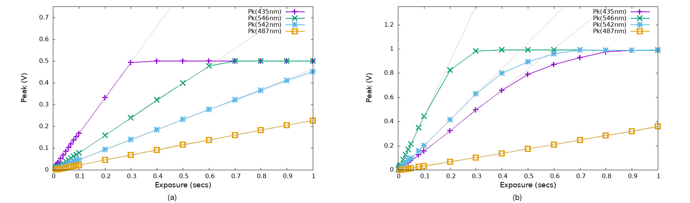
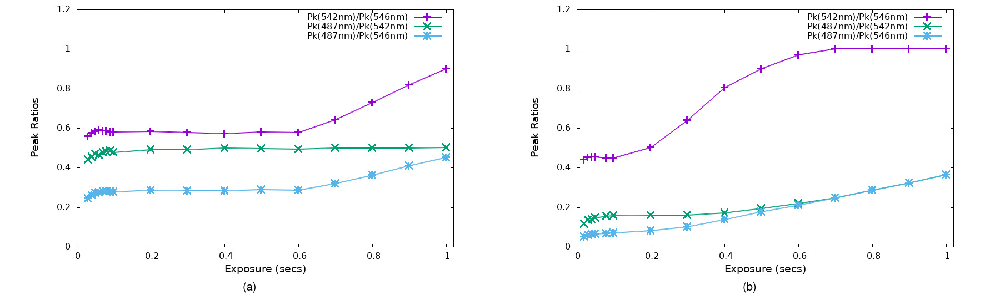
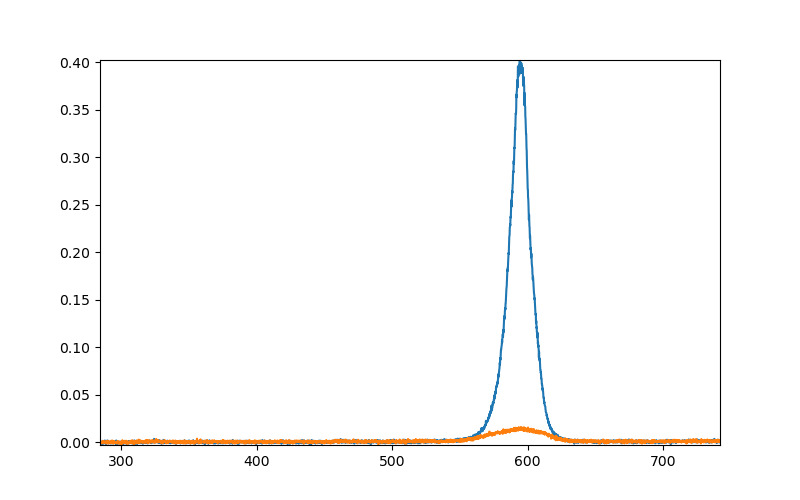

# TCD1304 Sensor with Linear Response and 16 Bit Differential ADC

 

#### Table of Contents
- [Introduction](#introduction)
	- [SPI Instrumentation Project](#-the-spi-instrumentation-project---open-instruments-for-open-science)
	- [Permissions](#-permissions-no-warranty-or-guarantee-and-etc)
- [High-level description of the hardware-firmware-software architecture](#high-level-description-of-the-hardware-firmware-software-architecture)
- [Getting it all up and running](#getting-it-all-up-and-running)
	- [Assembling or obtaining boards](#assembling-or-obtaining-boards)
	- [USB connection](#usb-connection)
	- [Loading the firmware](#loading-the-firmware)
	- [Setting up and running the python codes](#setting-up-and-running-the-python-codes)
- [On Linearity and reproducibility in CCD spectrometers](#on-linearity-and-reproducibility-in-ccd-spectrometers-with-data)
- [Setup for linearity testing](#setup-for-linearity-testing)
- [Spectrometer construction](#spectrometer-construction)
- [Electrical design (a tutorial)](#electrical-design)
	+ [TCD1304DG electrical characteristics](#tcd1304dg-electrical-characteristics)
	+ [Signal conditioning](#signal-conditioning)
	+ [Interfacing to an ADC](#interfacing-to-an-adc)
	+ [SPICE model for the 16 bit sensor board](#spice-models-for-the-16-bit-sensor-board)
	- [Gate driver and analog signal integrity](#gate-driver-and-analog-signal-integrity)
- [Appendix A - quick command list](#appendix-a-quick-command-list)

## Introduction

This repo offers a Linear-CCD (LCCD) sensor device based on the TCD1304DG that is designed specifically for *reproducible linear response*.  For a spectrometer, as will be shown, linear response becomes a prerequisite for producing data that can be reproduced by other researchers.
  
The sensor device is offered in three versions (high-end 16 bit, lower cost 12 bit, and analog), along with firmware ("sketch" file and header library), a user interface program (with graphics) and class library (Python) and an offline data processing program and class library (Python) to read and graph the ASCII files saved by the controller.  All three version of the hardware, when used with the provided firmware and a Teensy 4.x, are able to provide reproducible linear response over 5 orders of magnitude in exposure time (from 10usec) in clocked or triggered data collection.
 
Reproducibility is fundamental to doing science and we appreciate this even more when it comes to collecting data that we plan to include in a paper.  Other researchers should be able to obtain the same spectra that we see, the same ratios of peak heights, the same yields, and so forth.  As is well known, meeting these basic criteria has been a challenge for CCD spectrometers since their inception in the late 1980's. (We will show examples of this in a widely used commercial instrument.) Needless to say, this touches on the basic question of whether a dataset is meaningful.  But if these issues were addressed, CCD spectrometers with their "all at once" spectral capability and potentially low cost, would be an important contribution to the scientists toolbox.
The goal of this project was to finally and fully address these issues to produce a definitive design for the TCD1304 that provides data that is linear and highly reproducible.

In our studies leading to the present design, the TCD1304 itself proved to be remarkably linear. (Some vendors attribute their non-linearities to the sensor. As you will see, it is not true.)  Rather, the challenge is in electrical design to account for both the nature of the signals produced on reading a spectrum or technical image from the CCD and the stricter requirements on linearity of various types for purposes of a scientific instrument.  There is a second challenge described as a phantom or "carry-over" that has to be addressed in how the sensor is operated.  These challenges are  perhaps not too complicated, but they do require experience in having actually used these instruments as a scientist, and meticulously attention to detail and careful analysis in designing an instrument to do the job properly.  We offer the present design with the hope that this will "set a new bar" for linear response for a CCD based spectrometer.

In this README we cover a lot of ground, from getting and working with the boards, to documenting what linearity and non-linearity look like in real instruments and why it is important, explaining why the problem is especially tied to spectrometers, and providing a tutorial in electrical design with example circuits. We use SPICE models to illustrate key points and we include a collection of these in this repo so that you can explore the ideas for yourself.

This repo provides (a) fab files and BOM for making the boards, (b) firmware as an Arduino "sketch" and a header-only C++ library, (c) host software in Python that can be used as a class library or command line interface with realtime graphics, (d) this README with test results and tutorials for electrical and optical design, and (e) a collection of SPICE models as referred to in the text and including those we used to develop and test the design. 

We begin with a summary of what is contained in the rest of the readme and repo.

### Implementations

We provide three implementations of the sensor system (see the following figures); (a) a two board implementation comprising the [sensor board](TCD1304_SPI_Rev2EB/) and our [Teensy 4 based instrument controller](https://github.com/drmcnelson/Instrumentation-Controller-T4.0-Rev3), (b) a single board ["All-In-One"](TCD1304_All-In-One_FlexPWM/) implementation with sensor and MCU on back and front of the same board, and (c) an [Analog board](TCD1304_Analog) with the sensor, signal conditioning circuit and gate drivers with analog output of the inverted and amplified sensor signal.
All can be operated using the firmware and Python codes that we provide in this repo.

The following shows pictures of each version and discusses the costs associated with each. These include the sensor and microcontroller, currently running at $40 and $24 respectively and the PCB which generally runs around $12/board including shipping plus $6 tariffs.

#### Two board system, 16 bit sensor board and controller
The high end sensor system shown here, is a two board system comprising sensor board and controller. It offers very low electrical noise with a 16 bit 1MSPS ADC and good mechanical isolation of the sensor from the controller.  The boards are interconnected by a ribbon cable for logic and VDD (logical level power) and a separate two wire cable for 5V power. Fiduciary marks on both sides of the sensor board facilitate optical alignment.

Component costs are currently $110 for the sensor board and $88 for the controller, or $198 for the set, plus the time it takes to do the assembly work.  It takes us a few hours for each board, or about one day per board set.

We recently switched to using a PCBA service for the SMT parts (we prefer ALLPCB for their customer service).  Normally this would bring our costs to $290.  With tariffs our cost per set is now $395-$422 depending on the clearance agent.  But, compared to hand assembly, it is still a bargain.
 

 

<i>
TCD1304 Sensor system, (a) sensor board bottom showing sensor and fiduciary marks, (b) sensor board top showing circuits, interconnects and baseline trim, and (c) sensor board and controller showing geometry and interconnection (control and data plus 5V power).
</i>

#### "All-in-one", sensor and controller on a single board.
The following pictures show the single board device with sensor, electronics and controller all on one board.  This device offers similar performance in terms of linearity to the two board system, but with 12 bit precision using a single ended analog signal path and the built-in analog input of the Teensy 4.0 (and therefore fewer parts).

The component costs are currently $86 including TCD1304 and Teensy, plus $18 for the PCB, for a total of $104. We generally assemble these in house. The passives are 0603 or larger. The two IC's are 8 pin, 0.65mm pitch. It takes us a few hours or about half of a day.

 

<i>
TCD1304 All-In-One Board, (a) bottom showing the sensor, (b) top showing the microcontroller board and pins for auxiliary functions, and (c) view showing the overall geometry.
</i>

#### Analog sensor board with gate drivers
The following shows the analog sensor board which hosts the sensor with the single ended analog circuit and gate drivers similar to that used in the "all-in-one" board shown in the preceding. The board can be powered from 4V to 5.5V and accepts 3.3V to 5V logic. Alternatively, by opening a jumper, the gate and analog sections can be powered separately.  The output is intended to be compatible with typical Arduino board analog inputs.  It is recommended to use the Teensy, but an ARM processor with sufficiently fast cpu should work also.

Parts costs are currently $65 including the TCD1304, plus $18 for the PCB per the above, for a total of $83. The passives are 0603 and the ICs are SOT23 packages to make it a little easier for hand assembly.  It takes perhaps 3 hours to build.

&nbsp;

<i>
TCD1304 Analog Board, (a) top showing the circuits and connectors, (b) bottom showing the sensor.
</i>

### Reproducibility and linearity

Reproducibility is vitally important for any instrument.  For spectrometers linearity is a pre-requisite for reproducibility. And of course, linearity is also a pre-requisite for important capabilities such as signal averaging.  CCD spectrometers are historically challenged for linearity and reproducibility. We discuss this at length in the section titled [Linearity and Reproducibility in CCD Spectrometers](#on-linearity-and-reproducibility-in-ccd-spectrometers-with-data).  We show examples in data collected from a commercial instrument and compare this to data from the present design where the results are linear.  The data illustrate the relationship between linearity, reproducibility and being able to produce meaningful data.

### Construction of the spectrometer used for testing

Construction of the spectrometer used for testing the new sensor is described below [(here)](#spectrometer-construction).
We use a 1200/mm grating and 200μm entrance slit with a focal length of 2 1/4".
Total cost of materials for the spectrometer is under $400, including the electronics (this repo), optics and mechanical parts.

### Controller

As noted, we operate the sensor board using our newly updated ***Instrumentation Controller*** based on the Teensy 4, with its NXP i.MXRT 1060 ARM7 MCU [(please click here)](https://github.com/drmcnelson/Instrumentation-Controller-T4.0-Rev3).
The T4/NXP platform is somewhat unique among MCU boards in the Arduino ecosystem for both its speed at 600MHZ and its high speed USB at 480Mhz.   Additionally it provides a flexible timing generator (FlexPWM) which we feel is better suited to the task of operating the TCD1304 compared to the PWM peripherals offered in other MCU boards.   In the present system, including firmware and software, we are able to produce well controlled exposure times to as short as 10usec and frame rates a little faster than 100fps. 

### Firmware

The firmware [(here)](Firmware/), written for the T4, includes a header-only library to operate the sensor, and a "sketch" file (Arduino source code, similar to C++) that implements human readable commands and responses, operates the sensor to produce frames by clock or hardware trigger, and sends the data back to a host computer.

We expect that the firmware provides all of the functionality you may want for almost any sort of experiment.  However, we provide the TCD1304 library and the complete source code so that you can modify it if you wish.   We work with the code using the Arduino IDE for compilation and Emacs as an external editor. 

### Python user interface with graphical display

The Python code [(here)](Python/) can function as a user interface or as a class library.  When invoked directly, the code presents a graphical monitor and command line interpretor with human readable commands. When used as a library from another program (see "import"), the spectrometer is available as an instance of a class object.  The Class provides both high and low level functions to work with the device.  The design emphasizes simplicity and performance, again with anticipation that scientist users can modify the Python code to their purposes.   The command "help" lists detailed help text from the controller and from the Python code.

### Electronic design

A tutorial on electrical design for CCD sensors and spectroscopy is included [here](#electrical-design).  The section begins with the datasheet and characteristics of the sensor, proceeds to signal condition and driving an ADC and finishes with a section on the gate drivers.  SPICE files are included in a subdirectory of the repo.  You can modify the SPICE files to investigate your own designs.

### Fab files (Gerber, BOM) and codes

The fab files and code provided in this repo, and in the controller repo, plus some cabling and a host computer, should be sufficient to assemble the boards and get your detector system up and running.  Feel free to contact me for consultation or pre-assembled boards (time permitting).  And needless to say, donations are very much appreciated, please find and "click" the sponsorship button above.

###  The SPI Instrumentation Project - Open Instruments for Open Science
The contents of this repo are part of our effort in ***Open Instrumentation for Open Science***.  

We believe that access to doing great science should not be limited to those privileged in funding and affiliation nor held ransom to the extractive practices of the market in scientific instruments. And anyway, you may feel better served by instruments developed by other scientists who actually use them and have decades of experience designing professional instrumentation. The designs we provide can often be built at about 1/10 of the cost of the commercial instrument.  In our own research, we are typically able to do more with these boards than we can with the expensive commercial instruments.

At this writing, we have received requests and helped scientists working in Europe, Africa, India, Canada and the USA.

One very important way that you can help underfunded scientists is by clicking the "Sponsor" button at the top of this repo.   The funds go to helping to make more instruments more available to more scientists around the world.

If you would like to sponsor or receive boards, please contact me.

###  *Permissions, no warranty or guarantee, and etc.*
Permission is hereby granted for you to build and use these boards and codes in your lab and for your personal use.
Please cite appropriately if you use these in your published work.

Please contact me if you need/want:
<ul>
<li>
Pre-assembled boards
</li>
<li>
Customization, advice, etc.
</li>
<li>  
Permission for use in a product or other commercial effort
</li>
</ul>

And of course, no warranty or guarantee is given whatsoever.  We did our best.

If you have questions, please feel free to contact me.  And of course, don't forget to click the "Sponsor" button (or contact me directly).

 ***
## High-level description of the hardware-firmware-software architecture

The sensor is operated through four input pins, a clock and two gates plus a fourth for the "convert" pin of the ADC, and an SPI interface which retrieves the data from the ADC.  These connect to the controller and the controller in turn connects to the host as a serial port device over USB.  The controller also provides a trigger input and sync output and additional pins that can be used to interact with other equipment.  

The controller operates the sensor device with its FlexPWM  module programmed to serve as timing generator for the clock, gates and ADC convert signals, and its SPI module to read the ADC. A small set of interrupt service routines maintain frame counters, measure exposure times, and so forth.
At the end of the readout, the data record and the various parameters that accompany the data record are organized into a C struct as a "frame" and put onto a ring buffer.  In the main thread, the function loop() checks the ring buffer, sends pending data frames to the host, and processes command inputs from the host computer.  Every command is acknowledged by sending "DONE" back to the host.

The Python code running in the host, represents the sensor device and its controller through a class object, TCD1304CONTROLLER.  A multiprocessing thread TCD1304port listens to the port to receive data frames and messages sent in response to commands, and interacts with the main thread through a set of queues; the data queue, a queue for commands to send to the controller and a graphics queue for real time display.  The graphics window runs in a separate thread also.

Thus we have two levels of buffering, one in the controller and one in the host software, and commands and data are serialized on both ends of the interconnection between the host and controller.  The commands and responses are all simple human readable ASCII.  Data can be transferred as binary or ASCII.
 

***
## Getting it all up and running
This sensor board is intended to be used with our new [Teensy 4 (T4) based controller](https://github.com/drmcnelson/Instrumentation-Controller-T4.0-Rev3). 
The files provided here (gerbers and code) and in the controller repo, plus some trivial cabling and a host computer (we recommend Linux for the best frame rate perfomance) should be sufficient to build and operate the boards. 

If you are using the "All-In-One", then you have the TCD1304 and circuitry and the Teensy 4.0 all on one module. The gerbers are provided in their own directory in this repo.  There is one macro switch in the firmware that you need to uncomment to compile for the "All-In-One" board.

### Assembling or Obtaining boards
You can assemble the boards yourself, or if you prefer, please feel free to contact me for pre-assembled boards.

If you want to assemble your boards, and this is your first time assembling an SMT board, search for an introduction to DIY SMT assembly, [for example here](https://www.kingfieldpcb.com/essential-tips-for-diy-smt-assembly/).

Here are some notes on how we do assembly in our shop.
We order PCBs from AllPCB, JPLPCB, and PCBWay. We usually order parts from Digikey, but we also use Mouser and Newark.  We use Chip Quik no-clean solder paste in a syringe dispenser with fine needle tips that we order separately. And we use a reflow oven that we purchased through ebay for about $200, and sometimes we use a temperature controlled rework heating stage that we purchased through Amazon.

### USB connection
We recommend using a powered USB hub with switches to turn individual USB devices off and on. When you shop for this, make sure it can supply at least 1A per port.  For example, a powered 7-port USB hub should be able to supply at least 1A x 5V x 7 ports = 35W.  

### Loading the firmware
After the boards are assembled, you will need to install the Teensy board in the controller, and compile and load the code into the Teensy.  You will most likely want to use the Arduino IDE for this.  Teensy is well integrated into the IDE. [See here for setup instructions.](https://www.pjrc.com/teensy/td_download.html)   The Teensy needs to be connected by USB to your host computer for this step.

The firmware codes are found in the repo in the Firmware/ subdirectory

(In the following, the "251208" in the directory and file name, is the date of this version of the firmware.  If there is a newer version when you read this, use that one.)

    TCD1304Device_Controller_251208/
    
      TCD1304Device_Controller_251208.ino  - The controller program with CLI
    
      TCD1304Device2.h  -  A header-only C++ library for the TCD1304 and Teensy4.x (iMXRT106x)
      
      parselib.cpp      - A string parsing library for the CLI
      parselib.h

      Doxyfile          - Doxygen configuration file

      TCD1304Device_Controller_refman.pdf
                        - Listing generated by doxygen
      

The Arduino IDE requires that the "ino" file and directory have the same name.

To load firmware into the "All-In-One" board, open the file **TCD1304Device2.h** in a text editor or find its "tab" in the Arduino IDE, and un-comment the following line. It is at line 23 in the current version of the file.

      //#define ALLINONEBOARD

If you want to customize the firmware, it is recommended to create a new directory, copy the files to that directory and rename the ino file per the above.

After installing the Arduino IDE and Teensy package, you should be able to double click on the ino file to start an IDE session, or start the IDE and navigate to the directory and open the file.  

### Setting up and running the Python codes

Python codes and Bash scripts for operating the TCD1304DG sensor and working with the data, all under Linux, are provided in the repo under the subdirectory Python/.

The codes have been used with the Fedora Cinnamon Spin, which you can [download from here](https://fedoraproject.org/spins/cinnamon).   This uses xorg rather than Wayland, the desktop is Win7-like and it is easy to work with terminal windows. We have also done some preliminary testing in Ubuntu.

#### Installing the Python environment

The command to install the Python environment and libraries used by the codes is as follows (in Fedora, use apt-get or aptitude in Ubuntu):

    $ sudo dnf install python python-numpy python-scipy python-matplotlib python-pyserial
      

#### Setting up the user software for the TCD1304 boards
To setup the Python codes from this repo, unpack or download the files from the repo's Python subdirectory to a directory on your Linux machine; somewhere under your personal user directory works just fine.  And, set the permissions to allow execute  (chmod a+x *.py, and chmod a+x *.sh).

Here is a list of the files provided in the Python directory

    TCD1304Controller.py   - User interface and Class library
    
    GraphicsWindow.py      - Libraries used by TCD1304Controller.py
    GUIWindow.py
    TextWindow.py

    DataReader.py          - Offline library and graphics utility

    SetupPATH.sh           - Adds the code directory to PATH
        
    GraphTCD130Spectrum.sh - Offline graphics using DataReader.py
    
    Calibration2           - example wavelength calibration

 

#### Running the user command interface with real-time display and post collection shell scripts

You will want to add the directory for the Python and bash scripts to your PATH. You can do this by adding the following line to your .bashrc.  Alternatively you can run this from a command terminal, but you would then need to do it each time.  Note that the command begins with ". "

    $ . pythoncodesdirectory/SetupPATH.sh
  
After all of the above, make sure that your sensor controller is connected to your compute with a USB cable, that the cables are connected correctly if you are using the two board implementation, and then turn on the power and wait about 1/2 minute.

Now you can run the controller program.

    $ TCD1304Controller.py

The controller should open a grahics window.  The desktop will look something like this (this is from an earlier instrument with similar software):

Notice that in the console window, we have a prompt.  This is the command line interface presented by the Python program.  The Python CLI provides commands to wait, save to disk, run commands from a file, run shell commands, and etc., and passes all other commands to the hardware.  The command **help**, produces a listing of the commands recognized by the hardware and Python CLIs.   A listing of the help output can be found in the repo [here](Python/TCD1304.help).  A summary of some of the most often used commands can be found at the [bottom of this readme](#appendix-a---quick-command-list).

The firmware CLI provides commands at three levels.  The high level commands include **read \<n frames\> \<exposure\>** and **trigger \<n frames\> \<exposure\>** which collect a series of back-to-back exposures,  and **read \<n frames\> \<exposure\> \<frame interval\>** and **trigger \<n frames\> \<exposure\> \<frame interval\>** which produce frames with shorter exposure times (down to 10μsec).   Middle level commands **setup pulse..**, **setup frameset...**, **setup timer**, **start** and **trigger**, provide data collection with detailed control of the timing for the pulse sequence that operates the sensor.  A set of low level commands provide register level access to the FlexPWM timing generator in the MCU.

(In the above, the shortest physically possible interval between frames is the time it takes to read a frame from the sensor plus a small increment to operate the gates.  For back to back exposures, the minimum is around 10msecs. There is not a hard upper limit (even compared to cosmic time scales).  But there is a practical limit in terms of dark noise and cosmic rays.  For very short exposures, specifying both exposure and frame-interval for the read and trigger commands, the limits are set by the configured pulse widths and by the timers being based on 16 bit counters and 7 bit dividers with a 150MHz clock.  The shortest exposure is about 10μsecs. The longest frame interval in this mode is about 55 msecs. The firmware will send you an error message if you ask for a setting or combination that it recognizes as being not physically possible.)

In the Python program, incoming data is saved onto a queue. The command **save \<filespec\>** retrieves and writes the data to disk.  The command **clear** empties the data queue without writing to disk.

While still in the queue, the data frames can be added using **add all** which sums all of the data to one frame, or using **add framesets** which sums the data to produce a set of frames corresponding to a frame set.  After adding the frames, you can use **save** as above, or collect more data and add again.  The **add framesets** command requires that all of the data have the same number of frames in each frame set.

Following is an example that compares the data produced with a single frame at low intensity to that produced by adding 100 frames collected at the same signal intensity.  The signal to noise ratio increases by a factor of 10 as expected (√N).  Aside, being able to add data frames and obtain meaningful data is possible only when your instrument is linear.  We will discuss this in further detail in the next section.

After saving the data to disk, the Python program **DataReader.py** can be used to work with the data and produce graphs.  The command line accepts python language statements to define the graph vectors x, y, y2 and etc.  See the bash scripts included in the distribution for examples.

 ***
## On Linearity and reproducibility in CCD spectrometers (with data)

In this section we illustrate some of the challenges in linearity and reproducibility as observed in CCD spectrometers.  After defining some terms, we show examples that compare the performance of the present design and that of a widely used commercial instrument.  These also help to illustrate basic concepts and why this is important for reproducibility.

Linear response, for a spectrometer, means that the  measured response S is proportional to the number of photons P impinging on the detector. For a change in intensity at pixel "n", we expect that ΔSn = cn ΔPn where cn is a constant.  

When a system is linear we should see that (a) spectra collected with different exposure times agree with each other  (S1/t1 = S2/t2), (b) ratios of peak heights are constant (Sλa/Sλb at t1 = Sλa/Sλb at t2), and when summed the result agrees with that obtained by a single measurement with the combined exposure time S = St1 + St2 = St1+t2.

Notably our linearity criterion was expressed as a change in P and S.  Normally we would apply the above rules after subtracting a noise or background signal. Conveniently, for this kind of sensor, the dark noise SD is proportional to exposure time in the range of exposure times greater than 20msec and for this sensor system the electrical noise is several orders of magnitude smaller than the dark noise.  Therefore, for these longer exposure times, the total intensity (S = SP + SD) should also be linear.

That said, there are a few ways in which spectrometer response can be non-linear. Some of these can be corrected numerically provided the non-linearity meets certain mathematical criteria.  For example, measured values should at least be monotonically increasing in exposure time so that there can exist a unique mapping between a measurement and its corrected value.

However, some non-linearities involve bandwidth or line shape. And while a *valid* correction might exist, it is most often far easier and far more reliable to start with an instrument that has linear response.

Let's look at some data.

### Spectra
The following are fluorescent lamp spectra, from the present design and from a commercially produced spectrometer (Flame-S, Ocean Optics).  Notice that narrow spectral lines are stronger in the spectrum produced by the present design. The effect becomes especially clear at shorter wavelengths.  (For a gas phase lamp with δλ/λ broadening, lines are naturally sharper at shorter wavelengths.)

 

<i>
Fluorescent lamp spectrum, (a) new sensor and (b) commercial instrument.
</i>

The following is the spectrum from above from the new instrument,expanded to show the detail structure around 590nm and 615nm. The change of scale is needed because the scale in the above rendering is dominated by the strong response to the lines at 435nm and 546nm in the new instrument.

 

<i>Spectrum from the new instrument with expanded intensity scale to show detail around 590nm and 615nm.
</i>

### Intensity
The following shows the raw intensities versus exposure time for  four of the peaks that appear in the above spectra for the present design and the commercial instrument.  We select the strongest two lines, at 435nm and 546nm, and the smaller peak at 542nm and the wider peak at 487nm.  The vertical scale for the present design is volts read from the sensor.

In a linear instrument, all of these intensities should rise linearly with exposure time or overall intensity. In the present design, the curves are indeed straight lines from near the origin until near the limiting output voltage of the sensor at 0.6V.   For the commercial instrument, most of the range is not linear.  We will see more explicitly, how this effects relative peak heights.

 

<i>
Intensity versus exposure time for four spectral lines for (a) the present design and (b) the commercial instrument.   The present design demonstrates linear response.
</i>

### Normalized response

Lets look at the normalized response for the three lines 546nm, 542nm, and 487nm.  Dividing by exposure time, we expect the curves to be flat or at least monotonically increasing until they reach saturation.  Again we see that the present design does indeed provide flat response until it reaches the voltage limit of the chip.

 

<i>
Normalized response for (a) the present design and (b) the commercial instrument.   In the present design (a) the line at 546nm clips at 0.6 sec, see the "Intensity" graph above.
</i>

### Peak height ratios
We reasonably expect that in a reliable instrument ratios of intensity should not change when we change intensity or exposure time. We expect that spectra should look the same when we repeat a measurement. On a more serious level, quantitative comparison of intensities is a basic element of many experimental protocols.

The following shows ratios among the above three peaks as a function of exposure time.  The present design does indeed show roughly constant peak height ratios from above noise until the line at 546nm reaches the limiting voltage of the sensor (the purple and blue curves both have the intensity at 546nm in the denominator).

 

<i>
Peak height ratios for (a) the present design and (b) the commercial instrument versus exposure time.   In the present design (a) the line at 546nm clips at 0.6 sec, see the "Intensity" graph above.
</i>

### Baseline integrity
Baseline or background subtraction is often a necessary step in extracting intensity data from spectra.  There are a number of ways to do this, for example using dark spectra or regions of spectra where the experiment produces little intensity.  The former assumes the background is independent of the signal of interest and the latter assumes background is dominated by the dark noise of the detector rather than light.

The following shows a fluorescent lamp spectrum from [Wikipedia](https://upload.wikimedia.org/wikipedia/commons/8/83/Fluorescent_lighting_spectrum_peaks_labelled.png).
Notice the anomalous baseline to the blue side of the sharp peak at 631nm.  The shape is not like dark noise nor any sort of room lighting. We can speculate about its origin, but the important point is that it is not easily corrected.

Fluorescent lamp spectrum. 
<a href="https://commons.wikimedia.org/wiki/File:Fluorescent_lighting_spectrum_peaks_labelled.png">Original:  Deglr6328 at English WikipediaDerivative work:  H Padleckas</a>, <a href="http://creativecommons.org/licenses/by-sa/3.0/">CC BY-SA 3.0</a>, via Wikimedia Commons

### On origins of non-linearity and electrical characteristics of CCD spectrometers
The following provides some insight into how the above phenomena may emerge in   a CCD spectrometer (or imaging system).  We start with nature of the signal produced on reading a CCD detector and in particular the case where the instrument has good resolution and can produce narrow lines.

A simple way to think of a CCD is as an array of photodectors that produce charge when exposed to light, backed by a kind of shift register that preserves the quantity of charge while it is shuttled along the register towards one end in response to a clock signal. At the last pixel, charge is converted to voltage and presented at the output pin.  The response up to this last step, depends on  the combined transfer efficiencies from photodetector to readout register and then along the length of the readout register.

An important "takeaway" is that a CCD records a discrete spatial patten of light induced electric charge and on readout converts it to a discrete time series of voltages.  In this way, a sharp spectral line becomes a short pulse in time.  And that is what makes spectroscopy different from other signal acquisition scenarios.

In designing circuits for acoustics or radio frequency work, we might think in terms of a Nyquist frequency and we might accept some small non-linearity for signals approaching this "cutoff". But in a CCD spectrometer (or imaging system) a full scale step in voltage from one sample to the next can be a legitimate feature that has to rendered to a meaningful digital representation. We can think of this in terms in of bandwidth or dV/dt.

The following shows the Fourier transform of the above spectrum (blue), and on the second "y" axis we graph a response curve (orange) calculated for a simple low pass filter (single pole) with cutoff frequency at 1/2 of the sample rate much. As you can see, naive filtering produces about 10% attenuation for high frequency components that may be important for linear response to narrow spectral lines.

<i>
Fourier transform of the fluorescent lamp spectrum (blue) and single pole f/2 filter (orange).
</i>

A more intuitive way to look at this is shown in the following where we graph the spectrum as its first derivative, dV/dt.  We see that the line at 435nm which is markedly stronger in the present design instrument also has the largest dV/dt.
In electronics, dV/dt is related to *slew*.

<i>
First derivative (dV/dt) of the fluorescent lamp spectrum.
</i>

Circuits can be slew limited through the choice of OPAMP and by any of several ways of current starving the sampling capacitor in the input stage to the ADC.
Maximum slew and output current are characteristics usually listed in the datasheet for an OPAMP.

Before leaving this topic, we should mention another phenomenon that also effects linearity.
The CCD sensors used in spectroscopy can be 2K to 4K in length.  After  N steps along the CCD, single step transfer efficiency ε becomes εN.  Lost charge at each step appears in the next pixel.  Generally and remarkably, this effect is usually small if the manufacturers specs for clocking the chip are followed.
An easily much larger effect arises in moving charge from the photodiodes into the readout register.  This appears as a weak copy of the previous frame added to the next frame.  It is very important to drive the shift gate properly to minimize the effect.  After that, a typical method to further reduce the effect is to quickly pulse the shift gate a few times before starting the next exposure.

---
## Setup for linearity testing

The equipment list for our linearity study is as follows.  Construction of the spectrometer is described [here](#spectrometer-construction)

<ol>
<li> Spectrometer</li>
<li> Fluorescent lamp</li> 
<li> Neutral density wheel filter for attentuation (individual filters can be used instead)
<li> 200μm optical fiber
<li> Miscellaneous mechanicals to hold the lamp, ND filter and fiber.
</ol>

Once set up and aligned, the mechanical configuration remains fixed through the duration of the measurements.  The ND filter wheel is adjusted and left in a fixed setting for each dataset, each comprising a set of exposure settings.  

## Spectrometer Construction
The following describes the instrument that we used to test the new sensor device.  The following pictures show (a) the "optical bench" and (b) the optical bench with housing constructed of black opaque plastic.  The sensor can be seen mounted after the second lens and the controller can be seen at the top rear of the cover with a blue USB cable running to the computer.  Equations for the center wavelength, range and resolution are described in the following. For the present design we chose a center wavelength at 520nm.  The wavelength range is about 290nm to 740nm.  Optical resolution with a 200um slit is about 3nm.

  
&nbsp;
  

The parts list for the above is:

<ol>
<li>Grating, 1200 grooves/mm, Thorlabs GT50-12, $250</li>
<li>200μm entrance slit, DIY-Optics.com, ~$30</li>
<li>Plano Convex lenses (50 to 60mm fl for this design), ebay, ~$20</li>
<li>SMA905 fitting, Amazon, Digikey, Mouser, Ebay ~$15</li>
<li>Aluminum plate, OnlineMetals.com or Amazon</li>
<li>Mounts produced with a 3-d printer</li>
<li>Opaque black plastic sheets and black PVC tape, Amazon</li>
<li>TCD1304 sensor board and controller from this repo, with cables</li>
</ol>

Detailed discussions on designing a spectrometer are easily found by web search. We will mention a few important highlights as we go step by step through the design process for the above instrument.  Here is the geometry for reference.

First, let's choose a center wavelength.  For a grating with line density G (in lines/mm), the 1st order diffracted wavelength as a function of angle is given by

λ0 G = sin θin + sin θout. 

Setting the exit angle to zero (0) and our center wavelength at 500nm, with our 1200l/mm grating we have an incident angle of about 37 degrees. That happens to be the blaze angle for our grating, So, that works out very well.

The range in wavelength is set by the size of the detector and the focal length of the second lens,

G Δλ = cos(θout) LD/LF

where LD is the length of the active region along the detector and LF is the focal length. We have G = 1,200 l/mm, θout = 0, LD = 30mm and LF = 55mm fl. So our spectral range Δλ should be about 450nm.

For setup and alignment, the slit and sensor should be positioned at the foci of the lenses and the sensor should be parallel to the grating. (Note that the sensor is actually 0.7mm behind the face of its glass window.)
You can use a flashlight and fiber as input to align the device. It should look like a well focused rainbow on the face of the sensor.
An important concept is that the instrument in a sense, images the slit onto the detector.

In this geometry, we have a magnification factor roughly equal to the ratio of the focal lengths of the lenses.

M = cos(θin) LF/LC

That is about 0.8 for our geometry.  The TCD1304 pixel size is 8μmx200μm.  So a 200μm slit works makes good use of the pixel height but we give up some resolution.

δλ = cos(θin) wslit / G LC

where is wslit is the slit width.  For  wslit≈200μm and LC≈60mm, we expect δλ≈2.2nm.

In the preceding sections, you can see spectra from the instrument and indeed, the range is about 450nm and the narrowest line widths are in the range of 2nm.
Note that the wavelength range and pixel density set an effective limit on resolution.  For this instrument we have about 0.12nm per pixel.  A 25um slit would give an optical resolution of about 0.28nm, but spread across only 2 pixels.  

 

***
## Electrical design

We now describe some of the elements of circuit design for a CCD based spectrometer (or imaging system).
This will be something of a tutorial.  The idea is to support open science.  That includes being open about what you need to know to design something like this for yourself. We assume some basic knowledge of electronics.  The "attentive reader" will note that we make extensive use of SPICE models.

We include a set of SPICE models in the [SPICE subdirectory](SPICE/).  These form the basis of most of the illustrations shown in this README.

We start with characteristics of the TCD1304DG and then proceed through signal conditioning to the ADC, gate drivers, and power architecture.

The reader may also be interested in reading the description in our repo for the original "All-In-One" board, [here](https://github.com/drmcnelson/Linear-CCD-with-LTSpice-KiCAD-Firmware-and-Python-Library).

### TCD1304DG electrical characteristics and operation
The TCD1304DG datasheet can be downloaded [here](https://toshiba.semicon-storage.com/us/semiconductor/product/linear-image-sensors/detail.TCD1304DG.html).
The device architecture is shown in the following figure found on page 2 and labeled "Circuit Diagram".  We see a photodiode array, shift gate (SH), integration clear gate (ICG), CCD analog shift register and signal output buffer (OS), with pins SH, ICG, master clock ΦM, and OS plus power and ground.

TCD1304DG "circuit diagram", from page 2 of the datasheet.

Operation of the device is shown in the following timing diagrams which can be found on pages 6 and 7,

TCD1304DG timing diagrams, (a) coherent shutter and exposure, (b) "electronic shutter function", from page 6 and 7 of the datasheet.

As depicted, exposure begins and ends on the trailing end of pulses asserted on the SH pin, readout begins following assertion of SH and ICG together, and thereafter, data is clocked out at 1 pixel per four cycles of the master clock ΦM.

A table of capacitances for these pins is found on page 5. Without going into the details of how CCDs are constructed [(see here](https://www.chronix.co.jp/chronixjp/material/pdf/chronix/CCD-Image-Sensor-English.pdf)), we can infer that the large capacitance of the SH and ICG pins are consistent with these playing an important role in harvesting charge in the device. Four clock cycles per pixel readout further indicates a 4 cycle type CCD register. 

We discuss how to drive the gates, and in particular shift gate [here](#gate-driver-and-analog-signal-integrity).  The present discussion focuses on the analog signal conditioning part of the design.

TCD1304DG "gate capacitance", from page 5 of the datasheet.

Electrical characteristics of the TCD1304 output are described on page 3 of the datasheet (excerpted here). We include the diagram from "Note 8" to indicate the origin and direction of the signal in volts.  The output is a negative going signal from fixed DC level VOS typically 2.5 volts (var 1.5V to 3.5V) to VOS -0.6V  at saturation (min -0.450V) and the output impedance is typically 500Ω (max 1kΩ).

 

### TCD1304DG noise
The TCD1304DG datasheet reports dark noise as 2mV (typ, max 5mv) with 10 ms exposure. The following shows our measurement of the dark noise as a function of exposure time using our 16 bit sensor board.  As expected, dark noise is linear in exposure time. But there appears to be a floor for dark noise at about 0.6mV, which it approaches for exposure times less than 20ms. 

Dark noise vs exposure time in the new sensor device.
(Electrical noise with sensor removed is ~14uV)

Removing the chip from the board, the electrical noise is about 14uV. So it seems that the dark noise signal at 0.6mV really does originate in sensor chip.

Dark noise is known to be related to temperature with the usual Boltzmann dependence.
Some have reported reductions in noise by a factor of 4 with modest cooling to around 4C.

### Signal conditioning
For best performance we want to match the output of the TCD1304DG to the input range of our ADC.  For the two board configuration, this will be a 16 bit high precision ADC with a differential input and 4V reference. For the "all-in-one" board this will be the 12 bit analog input of the MCU with a range of 0 to 3.3V.  In either case we need to shift, flip and amplify the output from the sensor to match the input range of the ADC.

#### Single ended signal conditioning
The following shows a reasonable approach for the front end circuit. We use a dual OPAMP, the ADA4807-2, slew 225μV/s, input noise 3.1nV/√Hz, 0.1pA/√Hz, and input capacitance 1pf. The first unit is configured as a voltage follower to take care of the large variation in source impedance and the second is setup as an inverting amplifier with offset.  This gives us reproducible gain and it provides linear response with good noise performance.

#### Low noise differential signal conditioning
We use the following approach for 16 bit precision.  Similar to the above, the first unit is configured as a follower but the second is configured as an inverter with offset and unity gain.  The two outputs together provide a differential signal.  In implementation we follow this with a fully differential amplifier (FDA) and a differential input ADC.  For gain we get a factor of 2 for free and make up the rest in the FDA.  Cancellation between the differential pair improves noise performance for our mixed signal environment.

#### A don't-do DIY circuit
The following shows a design that appears from time to time in DIY postings.  The inventor typically omits the voltage-follower and instead goes straight to the inverting amplifier.  This of course makes the sensor part of the gain equation, G = R2/(R1+Rsensor).  But the sensor impedance as we noted above, varies from 500Ω to 1kΩ.  If the inventor is aware of the issue, they might make R1 very large to drown out the contribution from the sensor.  But to have gain, R2 has to be even larger, typically 2 to 5 times R1.  Now come the problems. 

With large values for R1 and R2 there is a large parallel resistance that dominates the noise density at the input, vn ≈ 0.13 √R// [units nV/√Hz] (see "Johnson noise").  This creates a trade-off between bandwidth and precision.
And with a very large R2, the pole formed with the input capacitance of the OPAMP at fp = 1/(2πR2Cinp) moves to lower frequency and can be within the bandwidth needed for readout.  The amplifier may be unstable and the data unreliable.  All of this is for a net savings of about $3 for leaving out the voltage-follower.  If you need to report spectra with reproducible intensities, it might be best to avoid devices that take this approach.

### Interfacing to an ADC
The present application requires analog to digital conversion at rates from 200KSPS to 1MSPS and between 12 and 16 bit precision depending on your specific needs. This put us in the domain of the SAR type ADC (successive approximation register) [see here](https://www.analog.com/en/resources/analog-dialogue/articles/the-right-adc-architecture.html).  There are some important details to using a SAR type ADC and moreso for our application.  This involves some nuance, so we start from the basics.

#### Spice model for ADC input
The SAR architecture comprises a sample and hold (S-H) circuit followed by a comparator and DAC which are operated by internal logic to implement the successive approximation algorithm.  The S-H circuit is seen by the driving circuitry as the input to the ADC.   In a simplified sense, it looks something like the following but with the switch driven by a clock.

 

We can implement this in a SPICE model as follows. For purposes of illustration, we include an ideal voltage source as the input.  C1 is the sampling capacitor, S1 is the switch that connects C1 to the input, and S1 is controlled by the clock V1.  When S1 opens, the voltage on C1 is converted to a digital representation by the SAR engine.  The time during which S1 is closed, is called the sampling window.
(Values for the internal resistance (Ron) and capacitance (C1) for a given ADC are usually available in its datasheet.)

 

ADC model with ideal voltage source.  Green = input, blue = sampling capacitor, grey = sampling window.

#### Factors effecting precision
For n bits of precision and full scale range Vfs, the voltage on C1 at the end of the sampling window has to be within 1 part in 2n of Vfs.
The input always has some series resistance, in this case Ron.
Therefore the sampling window has to be at least as long as n x ln(2) x Ron x C1.  

Voltage noise of a capacitor is <i>vc</i> = √(kT/C). 
For n bits of precision, we need <i>vc</i> < Vfs/2n.
The 30 pF sampling cap shown in the model produces about 11μV of noise and 1/216 = 15μV.

When you select an ADC, make sure to look for these parameters in the table of electrical characteristics or the equivalent circuit for the input in the datasheet.  Also don't forget to look at the graphs for SNR.  Often the SNR quoted in the beginning of the datasheet is less than the whole story.  And don't forget to look at PSRR.  And do follow the guidelines for selecting the voltage reference and for layout.

#### ADC kickback
Kickback describes what happens when the switch closes to connect the input to the driving circuit.

In the following we drive the S-H from a voltage follower instead of the ideal voltage source.  Now when S1 opens or closes we see spikes (circled) on both voltages and in the current through R1. This is the famous ***"<u>ADC kickback</u>"***. It arises in the current needed by C1 with the sudden change in voltage when the switch closes.

 

ADC model driven by OPAMP follower.  Green = out, blue = sar cap, grey = sampling window, red = current through R1.

 
#### Charge reservoir as solution for kickback
In the often recommended solution for kickback, we provide a charge reservoir in the form of a capacitor in front of the input to the switched capacitor network, as in the following illustration.  Now, when the switch closes, current flows from the charge reservoir, which is replenished on a somewhat slower time scale by the driver (the opamp).

 

The following shows the implementation of this scheme in our SPICE model. A cap C2 is added in front of the ADC to act as the charge reservoir for C1.  We see in the traces that charge for C1 now comes from C2 and the voltage on C2 is managed by a much smaller current through R1.  There is no discernible kickback in V(out) nor in the current through R1.

 

ADC model with recommended driver, charge reservoir C2.  Green = out, turquoise = adc in, blue = sar cap, grey = sampling window, red = current through R1, orange = current through C2.

The charge reservoir and series resistor together look like a low pass filter, but the components are chosen a little differently.
C2 needs to be large compared to C1 and R1 needs to be tuned between the current capacity of the OPAMP and allowing C2 to track the input. We make extensive use of SPICE modeling to check designs for response and precision.

#### dV/dt versus charge reservoir

You may recall our discussion about dV/dt and sharp spectra lines near the top of the README.  Here is what happens when a large dV/dt meets the charge reservoir that we added to support the sampling capacitor in the ADC.   The circuit in this example is a "full feature" single ended model from CCD to ADC.  The input is a pulse, and a little bit extreme with a 2ns rise time.

Notice that we now have a large current through R1 coincident with the leading and trailing edge of the pulse.  The current through C2 is as before.  So, large dV/dt meets cap serving as charge reservoir and produces a new kind of kickback.

Effect of dV/dt in charge reservoir.  Green = out, turquoise = sar cap, blue = sar cap, grey = sampling window, maroon = current through C2, red = current through R1.

The following shows a method for mitigating the new kickback.  We simply slow the pulse a little bit with a low pass filter in the feedback loop.  This has to be tuned somewhat to put the current within the capabilities of the OPAMP but still allow C2 to recover fast enough to meet the design requirements for precision.  We are able to get 18 bit precision in models. Real spectra are less demanding and our precision spec is 16 bits.

 
 
### SPICE models for the 16 bit sensor board

The following are screens from two of the spice models that we used in designing the sensor board.

#### Differential signal path and ADC
This is the [SPICE model for the analog signal path with ADC](SPICE/TCD1304DifferentialBuffer.asc).
The input is configured as a short pulse to stress the kickback management.  The second graph shows the voltage on the sampling capacitor converging to the input voltage within the sampling window.  Convergence is better than 1 part in 16 bits.

SPICE model for the 16 bit sensor board, analog section.
 
Red = sensor, Green = adc inp, turquoise = Cs+ (sar cap), blue = current through R11.

Convergence of V(Cs+) to input voltage for the 16 bit sensor board.
 
Red = sensor, Green = adc inp, turquoise = Cs+ (sar cap).

### Gate driver and analog signal integrity

Issues that require careful attention in designing the gate drivers, include the fact of the very large capacitance of the SH gate, the role of this gate in collection charge from the photodectors into the readout CCD register, and then an electrical effect in the rest of the circuit wherein noise from the gate drivers appears on the power rails.

#### Current requirements for driving the gates

Recalling the table at the top of the discussion on electrical design, we saw that the shift pin has a capacitance of 600pF.  As we will see in a moment, the shift pulse needs to be driven with a rise time that is short compared to the duration of the shift pulse, generally a factor of 20 can be appropriate.   This means that for a 1 usec shift pulse, we need at least 4V x 600 pf/ 50 nsec = 48mA.

A suitable way to drive the gate would look like the following.  We use a SN74LVC1T45 and an 82ohm series resistor.

#### Mitigating noise generated on the power rails
The following shows a SPICE model for the gate drivers. These generate a pulse on their power rails, so we power these from a separate voltage regulator.  The model includes a current limited supply for the LDO with inductor, in place of the filtered current limited 5V supply on the actual board.

Gate drivers and pulse generation on the power rails.
 
Blue = V(sh), Green is V(icg), Red = (V(ccb)-4.0492) x 1000, Grey = I(R6)

Note that the trace for voltage pulse on the supply side of the gate drivers is scaled times 1,000.  Using this model we confirm that the amplitude of the pulse is well within our power supply noise budget for the analog signal path.

#### Charge clearance, carry-over and relationship to gate driver
Now lets take a look at another way in which the gate driver effects performance in the analog section.  In the following figure we toggle an LED on and off in synchrony with the gate driver, vary the duration of the pulse on the SH gate and graph the fraction of signal that appears in the next frame after the LED is off.

Notice that the "carry-over" signal falls off with the same time constant as the RC formed by the SH gate (600pF) and our series resistor (200).  At 1 usec the contamination is better than 1 part in 10,000 and so carry-over is small compared to dark noise.  In our case, our gate driver can provide 50mA, so the time constant really is set by the RC.

This is a caution that the gates should not be driven directly from low current sources where the time constant will be current limited, for example from the digital I/O pins of a microcontroller, but rather from a proper gate driver that can deliver enough current to achieve a sufficiently rapid charging curve on the SH pin.

LED spectrum, orange curve is with LED off.
Carry-over appears with inadequate gate drive.

 

Carry-over decreases with SH pulse width.

***
## Appendix A - Quick command list

The followings is a subset of the commands implemented in the TCD1304 firmware and in the Python user utility (indicated as CLI).  Enter the command "help" for a more complete listing and consult the source code for further information.

<b>Quick command reference </b> 
See <b>help</b> for more details

| **Operation:** | *commands:* |
| :----- | :---- |
| *Timed exposures* | **read &lt;n&gt;&lt;exposure (secs)&gt;  → [wait read]** |
|  | **read &lt;n&gt; &lt;exposure (secs)&gt; &lt;interval (secs)&gt;  → [wait read]** |
| *Triggered timed exposures* | **trigger &lt;nframes&gt;&lt;exposure (secs)&gt;  → [wait trigger]** |
|  | **trigger &lt;nframes&gt; &lt;exposure (secs)&gt; &lt;interval (secs)&gt;  → [wait trigger]** |
|  | **trigger &lt;nsets&gt; &lt;nframes&gt; &lt;exposure (secs)&gt; &lt;interval (secs)&gt;  → [wait trigger]** |
| | |
| | (The CLI receives data frames onto its data queue. See CLI save, add and clear) |
| | |
| *Configure trigger* | **configure trigger** [ **rising\|falling\|change \| (no)pullup \| pin &lt;n&gt;** ]|
| | |
| *Configure clearing pulses* | **configure clearing pulses &lt;n&gt;**|
| | |
| **Mid level operations:** | *command sequence:* |
| *Timed exposures* | **setup pulse → setup timer &lt;secs&gt; &lt;n&gt; → start timer** |
| *Triggered timed*| **setup pulse → setup timer ... → setup trigger** [options] **→ start trigger**|
| *Triggered/gated* | **setup pulse → setup trigger ... → start trigger** |
| *Manual exposure* | **setup pulse → start pulse** (2x to form an exposure) |
| | |
| *Short exposures* | **setup frameset** &lt;exposure&gt; &lt;frame interval&gt; &lt;n&gt; ... **→ start frameset**|
| *Triggered frame sets* | **setup frameset ... → setup trigger → start trigger**|
| *Configure trigger* | **configure trigger** [ **rising\|falling\|change \| (no)pullup \| pin &lt;n&gt;**]|
| | |
| **CLI functions:** | **command:** |
| *Data summing*| **add frameset** - add queued data collating by frame number |
| | **add all** - adds all of the queued data resulting in a single frame|
| *Clear data and text queues* | **clear** |
| | |
| *Wait for completion* | **wait** |
| | |
| *Save to disk* | **save** &lt;filenameprefix&gt; |
| | |
| *Print help text* | **help** [report\|coefficients\|pulse\|frameset\|timer\|trigger] |
| | |
| *Execute from script* | @&lt;filename&gt; [args] |
| *Pass command to shell* | !command |
| *Exec in Python* | [leftside]=[rightside] |
| *List name space* | = |
| *Loop* (example)| for a_ in [0,.1,.2]: @testscript \"%.2f\"%(a_)"|
| | |
| *Print configured i/o pins*| **pins** |
| *Digital I/O*| **set pin** &lt;pin&gt; **hi\| lo\| output\| input\| pullup**  |
| | **pulse pin** &lt;pin&gt; &lt;usecs&gt; |
| | **read pin** &lt;pin&gt; |
| | **toggle pin** &lt;pin&gt; |
| | |
| *Quit* | quit \| exit \| ctrl-c |
 

