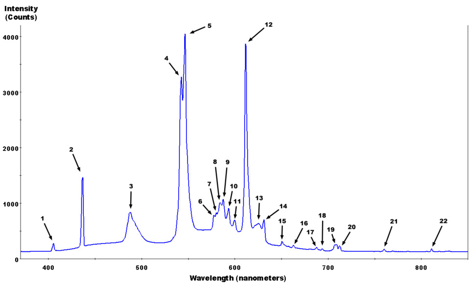

# TCD1304-SPI
TCD1304 sensor device with reproducible, linear response and 16 bit ADC, interface by SPI.

  

## Introduction
This repo will provide design files, gerbers, firmware, and host pc software in Python, for a linear CCD detector device designed specifically for radiometic linear response and reproducibility.  

The repo at this moment is under construction. But the results of our testing are exciting and we would like to share some of them with you.  The design files and codes will be added soon. In the meantime, please pardon our typos.

As is well known, scientific measurements have to be reproducible; in a practical sense you as well as other scientists should be able to repeat your measurements and obtain similar results.
This turns out to be a non trivial challenge for an instrument based on a linear CCD.
Researchers who use these instruments will be familiar with effects such as (a) intensity being carryied over from frame to frame or from pixel to pixel, (b) strong peaks being attenuated more than broad peaks, (c) peak height ratios that vary with changes in exposure time or light intensity, and (d) a "mysterious" anomalous response that seems specific to sharp spectral lines.
It is easy to understand that these sort of non linear behaviors generate results that are not reproducible.

We maintain that these non linearities originate in electrical design and to some degree how the device is operated, i.e. firmware.
And we further propose that the correct solution is to design the hardware to provide the required linearity to produce reproducible outputs.

While we want to "emphasize the positive", we feel some responsibility to comment on one thing.
It is certainly true, and easy to see, that the sorts of behaviors described above, some involving attenuation as a function of line width or steepness, some involving charge redistribution, and etc, are not amenable to a simple correction applied one pixel at a time.
Moreoever, finding a general solution to this (think of the inverse problem for example) would be quite challenging.
Meanwhile readers are advised to be wary of terms like "corrected linearity".
The far easier and perhaps the only correct approach, is to design the hardware to provide the required linearity.

In the following we will show you that the present instrument, based on the TCD1304DG, is in fact pretty linear, and can be used to produce reproducible results. 
This shows that the sensor itself is linear, and that achieving end to end linearity is a matter of circuit design and firmware.

The present sensor device as noted, is based on the TCD1304DG. The firmware includes a header only library that leverages the FlexPWM of the NXP iMXRT1062 crossover MCU to drive the gates in a reliable controlled way. And the 600MHz ARM7 MCU with 480MHz USB as implemented in the Teensy 4, is able to support frame rates to 100fps for the 3,694 pixel frames produced by the TCD1304DG.

After the introductory material and data, we will explain how all of this works in detail and provide some information to help you get up and running with your own copy of the device.

Since we are going to provide data to compare the present sensor design to commercial instruments lets start with construction of the do it yourself spectrometer that we used for the tests.

## Spectrometer construction
The spectrometer assembly is shown in the follow pictures, (a) optical "bench", (b) housing, (c) sensor board, and (d) controller.  We have a center wavelength of about 525nm and cover the range from about 300nm to 750nm with a resolution of about 3nm.

  
&nbsp;
  

  
&nbsp;
  

The parts list for the above is:

<ol>
<li>Grating, 1200 grooves/mm, Thorlabs GT50-12, $250</li>
<li>200μm entrance slit, 1 of a set of 6, ebay, ~$40</li>
<li>Plano Convex lenses (50 to 60mm fl), ebay, ~$20</li>
<li>SMA905 fitting, Amazon, Digikey, Mouser, Ebay ~$15</li>
<li>Aluminum plate, Online Metals or Amazon</li>
<li>Mounts produced with a 3-d printer</li>
<li>TCD1304 sensor board and controller from this repo, with cables</li>
</ol>

Detailed discussions on designing a spectrometer are easily found by web search. We will mention a few important highlights.

First, let's choose a center wavelength.  For a grating with line density G, the 1st order diffracted wavelength as a function of angle is given by

λ0 G = sin θin + sin θout. 

Setting the exit angle to zero (0), our 1200l/mm grating with a  center wavelength at 500 nm, gives us an incident angle of about 37 degrees. That happens to be the blaze angle for our grating, So, that works out very well.

The instrument when well aligned should image the slit onto the sensor, when the input is a narrow spectral line.  You can use a flashlight as input to align the device. It should look like a well focused rainbow dispersed across the face of the sensor.

The optics have a magnification factor equal to the ratio of the focal lengths of the lenses.  Our pixel size is 8μmx200μm, so at 1:1 a 200μm slit makes good use of the pixel height but we give up some resolution. Our resolution limited line width works out to be about 3nm.

The following shows the spectra produced with our spectrometer comapre to that produced by a popular commercial instrument, reportedly an Ocean Optics HR2000 (list price approximately $4,000 to $6,000). The [commercial produced spectrum is found here](https://commons.wikimedia.org/wiki/File:Fluorescent_lighting_spectrum_peaks_labelled.jpg).

Notice that we have slightly better resolution and there are some differences in peak heights.  Our grating has better efficiency in the blue, but notice that the Ocean Optics instrument is attenuating strong narrow lines, perhaps consistent with our description of dV/dt effects that need to be avoided in the signal acquisition circuitry.

And of course another important differences is that our cost is under $400, i.e., 1/10 of the cost of the commercial instrument.

&nbsp;

## Linearity studies with the new sensor design.

The equipment list for our linearity study is as follows.  Construction of the spectrometer is described [here](#spectrometer-construction)

<ol>
<li> Spectrometer built with our new sensor </li>
<li> Fluorescent lamp to serve as light source </li> 
<li> Neutral density wheel filter for attentuation (individual filters can be used instead)
<li> 200μm optical fiber
<li> Miscellaneous mechanicals to hold the lamp, ND filter and fiber in a fixed positions.
</ol>

Once set up and aligned, the mechanical configuration remains fixed through the duration of the measurements.  The ND filter wheel is adjusted and left in a fixed settting throughout a set of exposure setttings.  The instrument has two timing modes. For short exposures, the gates and readouts are all operated by a FlexPWM module of the Teensy 4 microcontroller.  The FlexPWM can support frame intervals to 50msec, for longer frame times or exposures, timing has to be supplied by a system level timer or a roll-your-own timer based on a spare timer module in the MCU.

### Results for the instrument based on the new TCDS1304DG sensor.

Lets start with the response of our instrument at three peaks, the smaller broader peak at 487nm, and the pair of strong peaks at 542nm and 546nm.   In the following note that the y axis is intensity divided by exposure time.  We expect that to be constant.

In this first figure we have a lot of attenuation to be able to span a wide range of exposure settings.
At the short exposure settings there may be some aberration from noise.  Otherwise we see that the data is monotonic and even without carefully treating the noise it seems pretty close to  linear over alomost all of the range.

Now lets look more closely at how the devices preserves the appearance of spectra and relative peak heights.  Here we use less attenuation to get above noise.  Notice that some of the peaks are clipped at longer exposure.  Nonetheless, the result is very reproducible, spectra overlay each other to well within noise, and peak height ratios are very flat except where one peak reaches saturation.

### Results for a widely used commercial instrument.
The following are fluorescent lamp spectra collected with a popular commercial CCD spectrometer. While this is not  a model that is currently offered by the manufacturer, it is widely availabe on ebay and it is still cited in in reports involving quantitative results. One recent example compares the effectiveness of sun screens.

The manufacturer of this instrument claims a "corrected linearity" of better than 99.8%.  The correction is a simple  polynomial in intensity with user specified order and coefficients, i.e. the correct intensity at pixel "*p*" is Ip' = a0 + a1Ip + a2Ip2 +  ...  
We might note also that the correction requires that the signal at each pixel is independent of other pixels and monotonically increasing with increasing light intensity.  Therefore, it remains to be determined whether the correction is valid and accordingly we do not apply the correction in this study.

In the folling it is easy to see that (a) the peak heights are not proportional to exposure time, and (b) relative peak hights vary with exposure time.  Looking at the data closely we also see that the response is not monotonic. 

### Contents of this repo
This repository at present contains the preliminary gerbers, schematic and BOM.  We will be adding updated design files, firmware, python code and a detailed explanation of how this works and in particular how we identified and solbed the linearity problem.

If you have questions in the meantime, please feel free to contact me.

